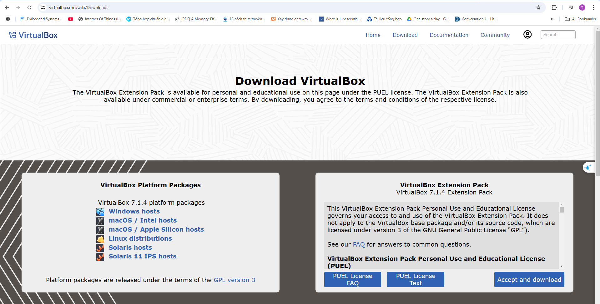
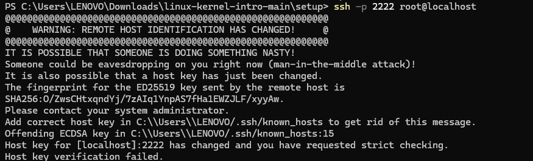
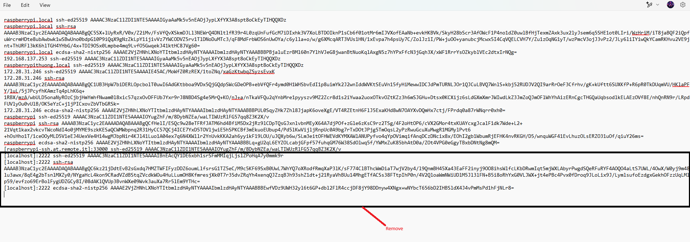

#   **AUTOMATIVE EMBEDDED**

         
     
     
     
     

##  **Table of Contents**
[Lesson 01: Setting Up Your First Keil µVision Project](#lesson-01-setting-up-your-first-keil-µvision-project) 
1. [Install Keil C ARM Package for STM32](#1-install-keil-c-arm-package-for-stm32)  
2. [µVision Software Packs Download and Install](#2-µvision-software-packs-download-and-install)  
3. [Create a New Project](#3-create-a-new-project)  
4. [Add Source Files](#4-add-source-files)  
5. [Configure Project Options](#5-configure-project-options)  
6. [Build the Project](#6-build-the-project)  
7. [Debug (Optional)](#7-debug-optional)  
8. [Download (Optional)](#8-download-optional)  

[Lesson 02: General-purpose I/Os (GPIO)](#lesson-02-general-purpose-ios-gpio)
1. [What is GPIO ?](#1-what-is-gpio)  
2. [What is the GPIO Port ?](#2-what-is-the-gpio-port)   
3. [GPIO Modes](#3-gpio-modes)  
  3.1. [GPIO Output](#31-gpio-output)    
  3.2. [GPIO Input](#32-gpio-input)   
  3.3. [GPIO Input Modes](#33-gpio-input-modes)               
    3.3.1. [High-impedance or Floating](#331-high-impedance-or-floating)    
    3.3.2. [Pull-up](#332-pull-up)  
    3.3.3. [Pull-down](#333-pull-down)  
  3.4. [GPIO Output Modes](#34-gpio-output-modes)  
    3.4.1. [Push-pull](#341-push-pull)  
    3.4.2. [Open-drain](#342-open-drain)  
  3.5. [Analog Mode](#35-analog-mode)  
  3.6. [Alternate Function Mode](#36-alternate-function-mode)  
4. [Blink LED PC13](#4-blink-led-pc13)
    4.1. [Địa chỉ các thanh ghi](#41-địa-chỉ-các-thanh-ghi)  
    4.2. [Enable the peripheral's clock](#42-enable-the-peripherals-clock)  
5. [STM32F10x Standard Peripherals Firmware Library](#5-stm32f10x-standard-peripherals-firmware-library)    
  5.1. [Cấu hình và sử dụng ngoại vi (GPIO)](#51-cấu-hình-và-sử-dụng-ngoại-vi-gpio)  
    5.1.1. 	[Cấp clock cho ngoại vi](#511-cấp-clock-cho-ngoại-vi)  
    5.1.2. [Cấu hình ngoại vi](#512-cấu-hình-ngoại-vi) 

[Lesson 03: Interrupt and Timer](#lesson-03-interrupt-and-timer)

[1. Interrupt](#1-interrupt)
1. [What is an Interrupt?](#11-what-is-an-interrupt)  
2. [How Interrupt Works](#12-how-interrupt-works)  
3. [Types of Interrupts](#13-types-of-interrupts)  
   - [1.3.1 Hardware Interrupts](#131-hardware-interrupts)  
   - [1.3.2 Software Interrupts](#132-software-interrupts)  
   - [1.3.3 Multiple Interrupts (Priority)](#133-multiple-interrupts-priority)  
   - [1.3.4 Interrupt Handler in STM Cortex-M](#134-interrupt-handler-in-stm-cortex-m)  
   - [1.3.5 Components of NVIC](#135-components-of-nvic)  
   - [1.3.6 Interrupt Request (IRQs) Table](#136-interrupt-request-irqs-table)  
   - [1.3.7 External Interrupt](#137-external-interrupt)  
   - [1.3.8 Timer Interrupt](#138-timer-interrupt)  
   - [1.3.9 Communication Interrupt](#139-communication-interrupt)  
4. [Priority](#14-priority)  

[2. Timer](#2-timer)
1. [What is a Timer?](#21-what-is-a-timer)  
2. [Timer Structure and Components](#22-timer-structure-and-components)  
3. [Timer Configuration Example](#23-timer-configuration-example)  
   - [3.1 RCC Configuration](#231-rcc-configuration)  
   - [3.2 GPIO Configuration](#232-gpio-configuration)  
   - [3.3 Timer Configuration](#233-timer-configuration)  
   - [3.4 Delay Function](#234-delay-function)  
4. [Code Example](#24-code-example)  
5. [Timer Operation](#25-timer-operation) 

[Lesson 04: Communication Protocols](#lesson-04-communication-protocols)
1. [Truyền nhận dữ liệu](#1-truyền-nhận-dữ-liệu)  
2. [SPI](#2-spi)  
3. [I2C](#3-i2c)  
4. [UART](#4-uart)  

[Lesson 05: SPI Software and Hardware](#lesson-05-spi-software-and-hardware)
1. [SPI software](#1-spi-software)  
2. [SPI hardware](#2-spi-hardware)  

[Lesson 06: I2C Software and Hardware](#lesson-06-i2c-software-and-hardware)
1. [I2C software](#1-i2c-software)  
2. [I2C hardware](#2-i2c-hardware)  

[Lesson 07: UART Software and Hardware](#lesson-07-uart-software-and-hardware)
1. [UART software](#1-uart-software)  
2. [UART hardware](#2-uart-hardware)  

[Lesson 08: Interrupt](#lesson-08-interrupt)
1. [External Interrupt](#1-external-interrupt)
2. [Timer Interrupt](#2-timer-interrupt) 
3. [Communication Interrupt](#3-communication-interrupt)

[Lesson 09: ADC](#lesson-09-adc)
1. [Định nghĩa](#1-định-nghĩa)  
2. [Sử dụng ADC trong STM32](#2-sử-dụng-adc-trong-stm32) 

[Lesson 10: DMA](#lesson-10-dma)
1. [Định nghĩa](#1-định-nghĩa)  
2. [Sử dụng ADC trong STM32](#2-dma-trong-stm32) 
3. [PWM](#3-pwm) 

[Lesson 11: Flash - Bootloader](#lesson-11-flash---bootloader)
1. [Flash](#1-flash)  
2. [Bootloader](#2-bootloader) 

## Lesson 01: Setting Up Your First Keil µVision Project

This guide outlines the basic steps for creating a new project in Keil µVision, a popular Integrated Development Environment (IDE) for embedded systems development.

### **1. Install Keil C ARM Package for STM32**

Visit the following link to download the package:

https://www.keil.arm.com/packs/stm32f1xx_dfp-keil/boards/

Tài liệu tham khảo: Datasheet, Reference Manual của MCU.

ST-Link driver.

### **2. µVision Software Packs Download and Install**

*   Open the Pack Installer by clicking on its icon: refer to the below image.

*   A Pack Installer Welcome screen will open. Read and close it.: refer to the below image.

*   Import the required software packs for your target microcontroller.

*   Choose and click **0K**.


### **3. Create a New Project**

*   Open Keil µVision.
*   Go to **Project** -> **New µVision Project**.

*   Create a new folder and provide the desired project name and click the save button in the window as shown below image. I called it the first_project. You can name anything.

*   Select the target microcontroller (e.g., STM32F103C8T6) from the device database.

*   Click **OK**.

### **4. Add Source Files**

*   In the **Project** window, right-click on "Source Group 1" and select **Add Files to Group 'Source Group 1'**.

*   Highlight the upper-left icon: C file (.c). And enter your source file’s name. I called it as **main.c**. Please refer to the below image.

*   Click on Add to close this window.

### **5. Configure Project Options**

*   In the **Project** window, double-click on **Target 1**.
*   Go to **Options for Target 'Target 1'**.
*   **Device:** Verify that the correct device is selected.
*   **Target:** 
    *   **Code Generation:** Configure compiler options (optimization level, warnings, etc.).
    *   **Linker:** Configure linker options (output file name, memory map, etc.).
    *   **Debug:** Configure debug settings (debugger type, communication interface, etc.).
*   **Output:** Configure output options (output file directory, create HEX file, etc.).

### **6. Build the Project**

*   Click on the **Build** button (or press **F7**) to compile and link your project.
*   Check the **Build Output** window for any errors or warnings.

### **7. Debug (Optional)**

*   If you have a hardware debugger connected, you can debug your project.
*   Set breakpoints in your code.
*   Step through the code line by line.
*   Inspect variables and memory.

### **8. Download (Optional)**

*   If you have a hardware target, you can download the compiled code to the target device.

**Note:**

* This is a basic guide. The specific steps and options may vary depending on the microcontroller you are using and your project requirements.
* Refer to the Keil µVision documentation for detailed information and advanced features.

**Example Source Code (main.c):**

```c
#include <stdio.h>

int main(void)
{
    // Your code here
    printf("Hello, world!\n");

    while(1); // Infinite loop

    return 0;
}
```

## Lesson 02: General-purpose I/Os (GPIO)

### **1. What is GPIO**

*   GPIO (General-Purpose Input/Output) là một trong những thuật ngữ thường gặp nhất mà bạn có thể gặp phải trong lĩnh vực nhúng. GPIO là một chân tín hiệu trên một mạch tích hợp hoặc bo mạch có thể được sử dụng để thực hiện các chức năng đầu vào hoặc đầu ra kỹ thuật số. Hành vi của GPIO (đầu vào hoặc đầu ra) được điều khiển tại thời điểm chạy bởi phần mềm ứng dụng/firmware bằng cách thiết lập một số thanh ghi. Ứng dụng điển hình bao gồm đọc/ghi giá trị từ/đến cảm biến/thiết bị analog hoặc kỹ thuật số, điều khiển đèn LED, điều khiển xung nhịp cho giao tiếp I2C, tạo xung kích hoạt cho các thành phần bên ngoài, phát sinh ngắt (interrupt), v.v.
*   Tất cả các vi điều khiển sẽ có một số thanh ghi để điều khiển các chức năng GPIO. Tên của các thanh ghi này sẽ khác nhau tùy thuộc vào vi điều khiển.

### **2. What is the GPIO port**

* Cổng GPIO (General Purpose Input/Output) trên vi điều khiển STM32F103C8 là một nhóm các chân (pin) đa năng, có thể được cấu hình để thực hiện các chức năng đầu vào hoặc đầu ra kỹ thuật số. Tưởng tượng chúng như những "cánh tay" của vi điều khiển, giúp thiết bị này tương tác với thế giới bên ngoài. Mỗi chân trong một cổng GPIO có thể được cá nhân hóa để đọc dữ liệu từ các cảm biến, điều khiển các thiết bị ngoại vi, hoặc tham gia vào các giao tiếp khác nhau. Việc nhóm các chân thành các cổng không chỉ giúp đơn giản hóa việc quản lý mà còn tăng hiệu quả trong việc cấu hình và sử dụng. Các cổng GPIO thường được đặt tên như GPIOA, GPIOB, GPIOC,... và mỗi cổng thường bao gồm 16 chân. Nhờ sự linh hoạt này, các vi điều khiển như STM32F103C8 có thể được ứng dụng trong vô số các dự án điện tử, từ những dự án đơn giản như điều khiển đèn LED đến những hệ thống tự động phức tạp.

### **3.GPIO Modes**

#### **3.1 GPIO Output** 


#### **3.2 GPIO Input** 


#### **3.3 GPIO Input Modes**

##### **3.3.1 High-impedance or Floating**

*   Bất cứ khi nào vi điều khiển được bật nguồn, các chân GPIO mặc định ở trạng thái đầu vào trở kháng cao.

*   Trạng thái trở kháng cao (High-impedance hoặc HI-Z) của một chân GPIO là trạng thái khi chân đó không được kết nối với mức điện áp cao (VCC) hoặc thấp (GND).

*   Trạng thái của chân trong trường hợp này là không xác định (không thể xác định được mức logic là 0 hay 1) trừ khi nó được kéo lên cao hoặc kéo xuống thấp từ bên ngoài.

*   Trạng thái nổi (floating) có thể dẫn đến dòng điện rò rỉ, dẫn đến tiêu thụ điện năng cao vì một chân nổi rất dễ bị nhiễu và có thể dẫn đến dòng điện rò rỉ.

🡪 Do đó, khuyến nghị nên giữ các chân không sử dụng ở trạng thái kéo lên (pull-up) hoặc kéo xuống (pull-down) để tránh dòng điện rò rỉ.


##### **3.3.2 Pull-up**

*   Điện trở kéo lên nội bộ được kết nối với chân. Do đó, trạng thái của chân sẽ là CAO (HIGH) trừ khi sử dụng điện trở kéo xuống bên ngoài.

*   Sẽ có một thanh ghi đặc biệt để kích hoạt điện trở kéo lên nội bộ này trong vi điều khiển (xem tài liệu datasheet).

**Giải thích**:

*   **Điện trở kéo lên nội bộ (Internal pull-up resistor)**: Đây là một điện trở được tích hợp sẵn bên trong vi điều khiển, một đầu được kết nối với chân GPIO, đầu còn lại được kết nối với nguồn điện (VCC).

*   **Trạng thái cao (HIGH)**: Khi điện trở kéo lên được kích hoạt, chân GPIO sẽ được kéo lên mức điện áp cao (VCC), tương đương với mức logic 1.

*   **Điện trở kéo xuống (pull-down resistor)**: Để thay đổi trạng thái mặc định, ta có thể kết nối một điện trở kéo xuống từ chân GPIO về đất (GND). Điều này sẽ kéo mức điện áp trên chân xuống mức thấp (LOW), tương đương với mức logic 0.

*   **Thanh ghi cấu hình**: Vi điều khiển cung cấp các thanh ghi để người dùng cấu hình các tính năng của GPIO, bao gồm cả việc kích hoạt/vô hiệu hóa điện trở kéo lên/kéo xuống.


##### **3.3.3 Pull-down**

*   Trong loại này, điện trở kéo xuống nội bộ được kết nối với chân. Do đó, trạng thái của chân sẽ là Thấp (LOW) trừ khi sử dụng điện trở kéo lên bên ngoài.

*   Sẽ có một thanh ghi đặc biệt để kích hoạt điện trở kéo xuống nội bộ này trong vi điều khiển.


**Giải thích**:

*   **Điện trở kéo xuống nội bộ (Internal pull-down resistor)**: Đây là một điện trở được tích hợp sẵn bên trong vi điều khiển, một đầu được kết nối với chân GPIO, đầu còn lại được kết nối với đất (GND).

*   **Trạng thái thấp (LOW)**: Khi điện trở kéo xuống được kích hoạt, chân GPIO sẽ bị kéo xuống mức điện áp thấp (GND), tương đương với mức logic 0.

*   **Điện trở kéo lên (pull-up resistor)**: Để thay đổi trạng thái mặc định, ta có thể kết nối một điện trở kéo lên từ chân GPIO về nguồn điện (VCC). Điều này sẽ kéo mức điện áp trên chân lên mức cao (HIGH), tương đương với mức logic 1.

*   **Thanh ghi cấu hình**: Vi điều khiển cung cấp các thanh ghi để người dùng cấu hình các tính năng của GPIO, bao gồm cả việc kích hoạt/vô hiệu hóa điện trở kéo xuống.

#### **3.4 GPIO Output Modes**

The GPIO is used to drive the electrical signal (high or low) to the pin when it is configured as a output. There are primarily two configuration options for GPIO outputs:

##### **3.4.1 Push-pull**

*   Trạng thái này là trạng thái mặc định của chế độ đầu ra GPIO. Chân có thể "đẩy" tín hiệu lên cao hoặc "kéo" nó xuống thấp bằng cách sử dụng transistor PMOS hoặc NMOS.

*   Không cần sử dụng điện trở kéo lên hoặc kéo xuống vì các transistor PMOS và NMOS đã thực hiện công việc đó.


**Giải thích**:

**Chế độ đầu ra GPIO**: Khi một chân GPIO được cấu hình ở chế độ đầu ra, vi điều khiển có thể chủ động điều khiển mức điện áp trên chân đó.

**Transistor PMOS và NMOS**:

*   **PMOS (P-channel Metal-Oxide-Semiconductor)**: Là một loại transistor hiệu ứng trường. Khi áp điện áp âm (hoặc không có điện áp) lên cổng (gate) của PMOS, transistor sẽ dẫn điện, cho phép dòng điện chảy qua.

*   **NMOS (N-channel Metal-Oxide-Semiconductor)**: Là một loại transistor hiệu ứng trường khác. Khi áp điện áp dương lên cổng (gate) của NMOS, transistor sẽ dẫn điện, cho phép dòng điện chảy qua.

**"Push" và "Pull"**:

*   **"Push" (đẩy)**: Khi vi điều khiển muốn đặt mức điện áp cao (HIGH) trên chân GPIO, nó sẽ điều khiển transistor PMOS để cho phép dòng điện chảy từ nguồn điện (VCC) đến chân GPIO.

*   **"Pull" (kéo)**: Khi vi điều khiển muốn đặt mức điện áp thấp (LOW) trên chân GPIO, nó sẽ điều khiển transistor NMOS để cho phép dòng điện chảy từ chân GPIO về đất (GND).

##### **3.4.2 Open-drain**

*   Trong chế độ đầu ra GPIO, bộ đệm đầu ra được hình thành bằng cách sử dụng các transistor PMOS và NMOS. Nếu bạn loại bỏ transistor PMOS, thì đó sẽ là chế độ đầu ra mở (open drain).

*   Tên gọi này xuất phát từ thực tế là cực thoát (drain) của MOSFET không được kết nối với bất kỳ thứ gì bên trong. Nếu bạn sử dụng BJT thay cho MOSFET, thì điều này được gọi là đầu ra thu gom mở (open collector).

*   Khi bạn kích hoạt NMOS, nó sẽ cung cấp kết nối với GND. Chân GPIO sẽ ở mức Thấp.

*   Khi bạn tắt NMOS, chân GPIO sẽ không được kết nối với Vcc hoặc GND. Nó sẽ ở trạng thái nổi. Do đó, đầu ra sẽ ở mức Thấp hoặc trở kháng cao (nổi). Nó có thể kéo chân xuống mức thấp nhưng không thể đẩy nó lên mức cao.

*   Đầu ra mở thường được sử dụng trong các giao tiếp truyền thông nơi nhiều thiết bị được kết nối trên cùng một đường dây (ví dụ: I2C, One-Wire, v.v.). Khi tất cả các đầu ra của các thiết bị được kết nối với đường dây ở trạng thái Hi-Z, đường dây được kéo lên mức logic 1 mặc định bởi một điện trở kéo lên. Bất kỳ thiết bị nào cũng có thể kéo đường dây xuống mức logic 0 bằng cách sử dụng đầu ra mở của nó và tất cả các thiết bị đều có thể nhận thấy mức này.


**Giải thích**:

*   **Chế độ đầu ra mở (Open Drain)**: Trong chế độ này, chỉ có transistor NMOS được sử dụng. Điều này có nghĩa là chân GPIO chỉ có thể được "kéo xuống" mức thấp (GND) khi NMOS được kích hoạt. Khi NMOS không được kích hoạt, chân GPIO sẽ ở trạng thái nổi (không được kết nối với nguồn điện).

*   **Ứng dụng của chế độ đầu ra mở**: Chế độ này thường được sử dụng trong các giao tiếp truyền thông như I2C và One-Wire, nơi nhiều thiết bị được kết nối trên cùng một đường dây. Bằng cách sử dụng đầu ra mở, các thiết bị có thể chia sẻ đường dây chung mà không gây xung đột.

*   **Cơ chế hoạt động**: Khi một thiết bị cần truyền dữ liệu, nó sẽ kích hoạt transistor NMOS của mình, kéo đường dây xuống mức thấp. Các thiết bị khác trên đường dây có thể nhận biết sự thay đổi trạng thái này. Khi không có thiết bị nào đang truyền dữ liệu, điện trở kéo lên sẽ kéo đường dây trở lại mức cao.

#### **3.5 Analog Mode**

*   Chế độ này kết nối chân với bộ chuyển đổi analog sang số (ADC) nội bộ và cho phép bạn đọc một giá trị đại diện cho điện áp nhất định tại chân đó.

*   Giá trị phụ thuộc vào độ phân giải của ADC, ví dụ, một ADC 12 bit có thể có giá trị từ 0 đến 4095.

*   Giá trị này được ánh xạ tới một điện áp nằm trong khoảng từ 0V đến (thường là) điện áp mà vi điều khiển đang chạy (ví dụ: 3.3V).

*   Khi một GPIO được cấu hình ở chế độ analog, các điện trở kéo lên/kéo xuống đầu vào sẽ bị ngắt kết nối (nổi).

**Giải thích**:

*   **Chế độ Analog**: Khi một chân GPIO được cấu hình ở chế độ analog, nó sẽ được kết nối với một bộ chuyển đổi analog sang số (ADC) tích hợp bên trong vi điều khiển. ADC là một mạch điện tử chuyển đổi tín hiệu điện áp tương tự (analog) thành tín hiệu số (digital).

*   Đọc giá trị điện áp: Trong chế độ analog, bạn có thể đo được điện áp tương ứng với tín hiệu analog được áp dụng lên chân GPIO.

*   Độ phân giải ADC: Độ phân giải của ADC quyết định độ chính xác của phép đo. ADC 12 bit có thể phân biệt 2^12 = 4096 mức điện áp khác nhau.

*   Ánh xạ giá trị: Giá trị số đọc được từ ADC sẽ được ánh xạ tương ứng với mức điện áp thực tế trên chân GPIO. Ví dụ, nếu điện áp tối đa là 3.3V, giá trị 0 tương ứng với 0V và giá trị 4095 tương ứng với 3.3V.

*   Ngắt kết nối điện trở kéo lên/kéo xuống: Trong chế độ analog, các điện trở kéo lên/kéo xuống thường được ngắt kết nối để không ảnh hưởng đến phép đo điện áp chính xác.

#### **3.6 Alternate Function Mode**

*   Các chân GPIO có khả năng cung cấp một chức năng thay thế ngoài ba chế độ thông thường.

*   Các chân được đa nhiệm để cung cấp các chức năng: chân Rx/Tx của UART, chân I2C, v.v.

*   Sẽ có một thanh ghi riêng biệt để thiết lập các chức năng thay thế.

**Giải thích**:

*   **Chức năng thay thế (Alternate Function)**: Ngoài các chế độ cơ bản như đầu vào (input), đầu ra (output) và analog, nhiều chân GPIO có thể được cấu hình để thực hiện các chức năng đặc biệt khác.

*   **Đa nhiệm (Multiplexing)**: Một chân GPIO có thể được sử dụng cho nhiều mục đích khác nhau. Ví dụ, một chân GPIO có thể được cấu hình làm đầu vào thông thường, hoặc làm chân truyền dữ liệu nhận (Rx) của giao tiếp UART, hoặc làm chân truyền dữ liệu gửi (Tx) của giao tiếp UART, tùy thuộc vào cách cấu hình.

*   **Thanh ghi cấu hình**: Vi điều khiển cung cấp các thanh ghi đặc biệt để chọn chức năng thay thế cho từng chân GPIO. Bằng cách viết giá trị thích hợp vào các thanh ghi này, người dùng có thể cấu hình chân GPIO để thực hiện các chức năng như UART, I2C, SPI, SPI, PWM, ADC, DAC, v.v.

### **4. Blink LED PC13**

*   **Step 1:** Enable the peripheral's clock
*   **Step 2:** Configure the peripheral's functionality
*   **Step 3:** Activate and use the peripheral

#### **4.1 Địa chỉ các thanh ghi**


#### **4.2 Enable the peripheral's clock**

*   Tất cả các chân của STM32F103 được nhóm thành nhiều cổng như PORT A, PORT B, PORT C Như có thể thấy từ biểu đồ cấu hình chân trong PA1 là viết tắt của Port A Pin 1. Có 37 chân GPIO trong stm32f103 được chia thành PORT A có 16 chân, PORT B ​​có 16 chân, PORT C có 3 chân và PORT D có 2 chân.

*   Mỗi cổng GPIO có hai thanh ghi cấu hình 32 bit (GPIOx_CRL, GPIOx_CRH), hai thanh ghi dữ liệu 32 bit (GPIOx_IDR, GPIOx_ODR), một thanh ghi thiết lập/đặt lại 32 bit (GPIOx_BSRR), một thanh ghi đặt lại 16 bit (GPIOx_BRR) và một thanh ghi khóa 32 bit (GPIOx_LCKR).

*   Trong tên thanh ghi, x biểu thị cổng mà chân đó thuộc về. Nếu chúng ta đang cấu hình chân PA1 , chân này có Cổng A thì các thanh ghi sẽ được truy cập bởi GPIOA _CRL, v.v.


**main.c**
```c
#define RCC_APB2ENR   *(( unsigned int *  )0x40021018)
#define GPIO_CRH      *(( unsigned int *  )0x40011004)
#define GPIO_ODR      *(( unsigned int *  )0x4001100C)

void delay ( unsigned int  timedelay)  {
  for ( unsigned int i = 0; i < timedelay; i++  );

}

int main () {

  RCC_APB2ENR |= ( 1 << 4 );
  GPIO_CRH |= ( 3 << 20 );
  GPIO_CRH &= ~(  3 << 22 );
  
  while (1) {
    GPIO_ODR  |= ( 1 << 13);
    delay (1000000);
    GPIO_ODR  &=  ~( 1 << 13);
    delay (1000000);
  }
}

```


```c
typedef struct
{
  unsigned int CRL;
  unsigned int CRH;
  unsigned int IDR;
  unsigned int ODR;
  unsigned int BSRR;
  unsigned int BRR;
  unsigned int LCKR;
} GPIO_TypeDef;

typedef struct
{
  unsigned int CR;
  unsigned int CFGR;
  unsigned int CIR;
  unsigned int APB2RSTR;
  unsigned int APB1RSTR;
  unsigned int AHBENR;
  unsigned int APB2ENR;
  unsigned int APB1ENR;
  unsigned int BDCR;
  unsigned int CSR;
} RCC_TypeDef;
```
**main.c**
```c
#define 	RCC_BASEADDR      0x40021000
#define 	GPIOC_BASEADDR    0x40011000
#define 	GPIOA_BASEADDR    0x40010800

typedef struct
{
  unsigned int CRL;
  unsigned int CRH;
  unsigned int IDR;
  unsigned int ODR;
  unsigned int BSRR;
  unsigned int BRR;
  unsigned int LCKR;
} GPIO_RegDef_t;
#define	GPIOC		((GPIO_RegDef_t *)GPIOC_BASEADDR)
#define	GPIOA		((GPIO_RegDef_t *)GPIOA_BASEADDR)

typedef struct
{
  unsigned int CR;
  unsigned int CFGR;
  unsigned int CIR;
  unsigned int APB2RSTR;
  unsigned int APB1RSTR;
  unsigned int AHBENR;
  unsigned int APB2ENR;
  unsigned int APB1ENR;
  unsigned int BDCR;
  unsigned int CSR;
} RCC_RegDef_t;
#define	RCC		((RCC_RegDef_t *)RCC_BASEADDR)

void delay( unsigned int  timedelay	)  {
  for (unsigned int i = 0; i < timedelay; i++) {
        
    }
}

int main(){
    
    RCC->APB2ENR|= (1 << 4);	
    GPIOC->CRH |= (3 << 20);		
    GPIOC->CRH &= ~(3 << 22);
    
    while(1){
        GPIOC->ODR |= (1 << 13);
        delay(1000000);
        GPIOC->ODR &= ~(1 << 13);
        delay(1000000);
    }
}
```

### **5. STM32F10x Standard Peripherals Firmware Library**

*   Là 1 thư viện hoàn chỉnh được phát triển cho dòng STM32. Bao gồm đầy đủ driver cho tất cả các ngoại vi tiêu chuẩn.

*   Thư viện này bao gồm các hàm, cấu trúc dữ liệu và macro của các tính năng thiết bị ngoại vi STM32. 


####  **5.1 Cấu hình và sử dụng ngoại vi (GPIO)**

*   Chọn chế độ: Đọc giá trị hiện tại của thanh ghi cấu hình, xóa các bit cần thiết và đặt các bit mới để thiết lập chế độ làm việc cho chân.
*   Thiết lập tốc độ: Nếu cần, cấu hình tốc độ hoạt động của chân.
*   Thiết lập kiểu đầu ra: Chọn kiểu đầu ra là push-pull hay open-drain.
*   Kích hoạt đồng hồ: Bật đồng hồ cho cổng GPIO.

#####  **5.1.1 Cấp clock cho ngoại vi**

*   Module RCC cung cấp các hàm để cấu hình xung clock.

```c
RCC_APB1PeriphClockCmd
RCC_APB2PeriphClockCmd
RCC_AHBPeriphClockCmd
```
**Hàm này nhận 2 tham số**:
* Ngoại vi muốn cấp clock
* Cho phép (ENABLE) hoặc không cho phép (DISABLE) cấp clcok cho ngoại vi


#####  **5.1.2 Cấu hình ngoại vi**

*   Các tham số dùng để cấu hình cho GPIO được tổ chức trong 1 struct:
```c
typedef struct
{
  uint16_t GPIO_Pin;             /*!< Specifies the GPIO pins to be configured.
                                      This parameter can be any value of @ref GPIO_pins_define */

  GPIOSpeed_TypeDef GPIO_Speed;  /*!< Specifies the speed for the selected pins.
                                      This parameter can be a value of @ref GPIOSpeed_TypeDef */

  GPIOMode_TypeDef GPIO_Mode;    /*!< Specifies the operating mode for the selected pins.
                                      This parameter can be a value of @ref GPIOMode_TypeDef */
}GPIO_InitTypeDef;
```

```c
void GPIO_Config(){
    GPIO_InitTypeDef GPIO_InitStruct;

    GPIO_InitStruct.GPIO_Pin = GPIO_Pin_13;
    GPIO_InitStruct.GPIO_Mode = GPIO_Mode_Out_PP;
    GPIO_InitStruct.GPIO_Speed = GPIO_Speed_50MHz;
    
    GPIO_Init(GPIOC, &GPIO_InitStruct); // Lưu các cài đặt vào thanh ghi
}
```
*   **Các hàm thông dụng**:
```c
uint8_t GPIO_ReadInputDataBit(GPIO_TypeDef* GPIOx, uint16_t GPIO_Pin);
\\Đọc giá trị 1 chân trong GPIO được cấu hình là INPUT
uint16_t GPIO_ReadInputData(GPIO_TypeDef* GPIOx);
\\Đọc giá trị nguyên GPIO được cấu hình là INPUT
uint8_t GPIO_ReadOutputDataBit(GPIO_TypeDef* GPIOx, uint16_t GPIO_Pin);
\\Đọc giá trị 1 chân trong GPIO được cấu hình là OUTPUT
uint16_t GPIO_ReadOutputData(GPIO_TypeDef* GPIOx);
\\Đọc giá trị nguyên GPIO được cấu hình là OUTPUT
void GPIO_SetBits(GPIO_TypeDef* GPIOx, uint16_t GPIO_Pin);
\\Cho giá trị điện áp của 1 chân trong GPIO = 1
void GPIO_ResetBits(GPIO_TypeDef* GPIOx, uint16_t GPIO_Pin);
\\Cho giá trị điện áp của 1 chân trong GPIO = 0
void GPIO_WriteBit(GPIO_TypeDef* GPIOx, uint16_t GPIO_Pin, BitAction BitVal);
\\Ghi giá trị "BitVal" vào 1 chân trong GPIO
void GPIO_Write(GPIO_TypeDef* GPIOx, uint16_t PortVal);
\\Ghi giá trị "PortVal" vào nguyên GPIO
```
**RCC_APB2PeriphClockCmd**
```C
/**
  * @brief  Enables or disables the High Speed APB (APB2) peripheral clock.
  * @param  RCC_APB2Periph: specifies the APB2 peripheral to gates its clock.
  *   This parameter can be any combination of the following values:
  *     @arg RCC_APB2Periph_AFIO, RCC_APB2Periph_GPIOA, RCC_APB2Periph_GPIOB,
  *          RCC_APB2Periph_GPIOC, RCC_APB2Periph_GPIOD, RCC_APB2Periph_GPIOE,
  *          RCC_APB2Periph_GPIOF, RCC_APB2Periph_GPIOG, RCC_APB2Periph_ADC1,
  *          RCC_APB2Periph_ADC2, RCC_APB2Periph_TIM1, RCC_APB2Periph_SPI1,
  *          RCC_APB2Periph_TIM8, RCC_APB2Periph_USART1, RCC_APB2Periph_ADC3,
  *          RCC_APB2Periph_TIM15, RCC_APB2Periph_TIM16, RCC_APB2Periph_TIM17,
  *          RCC_APB2Periph_TIM9, RCC_APB2Periph_TIM10, RCC_APB2Periph_TIM11     
  * @param  NewState: new state of the specified peripheral clock.
  *   This parameter can be: ENABLE or DISABLE.
  * @retval None
  */
void RCC_APB2PeriphClockCmd(uint32_t RCC_APB2Periph, FunctionalState NewState)
{
  /* Check the parameters */
  assert_param(IS_RCC_APB2_PERIPH(RCC_APB2Periph));
  assert_param(IS_FUNCTIONAL_STATE(NewState));
  if (NewState != DISABLE)
  {
    RCC->APB2ENR |= RCC_APB2Periph;
  }
  else
  {
    RCC->APB2ENR &= ~RCC_APB2Periph;
  }
}
```

**main.c**
```c
#include "stm32f10x_gpio.h"             // Device:StdPeriph Drivers:GPIO
#include "stm32f10x_rcc.h"              // Device:StdPeriph Drivers:RCC
#include "stm32f10x.h"                  // Device header

void RCC_Config() {
    RCC_APB2PeriphClockCmd(RCC_APB2Periph_GPIOC, ENABLE);
}

void GPIO_Config(){
    GPIO_InitTypeDef GPIO_InitStruct;

    GPIO_InitStruct.GPIO_Pin = GPIO_Pin_13;
    GPIO_InitStruct.GPIO_Mode = GPIO_Mode_Out_PP;
    GPIO_InitStruct.GPIO_Speed = GPIO_Speed_50MHz;
    
    GPIO_Init(GPIOC, &GPIO_InitStruct); // Luu các cài d?t vào thanh ghi
}

void delay(unsigned int time) {
    for (int i = 0; i < time; i++) {}
}

int main() {
    RCC_Config();
    GPIO_Config();

    while (1) {
        GPIO_SetBits(GPIOC, GPIO_Pin_13);
        delay(1000000);
        GPIO_ResetBits(GPIOC, GPIO_Pin_13);
        delay(1000000);
    }
}
```
**main.c**
```c
#include "stm32f10x_gpio.h"             // Device:StdPeriph Drivers:GPIO
#include "stm32f10x_rcc.h"              // Device:StdPeriph Drivers:RCC
#include "stm32f10x.h"                  // Device header

void RCC_Config() {
    RCC_APB2PeriphClockCmd(RCC_APB2Periph_GPIOC, ENABLE);
}

void GPIO_Config(){
    GPIO_InitTypeDef GPIO_InitStruct;

    GPIO_InitStruct.GPIO_Pin = GPIO_Pin_4 | GPIO_Pin_5 | GPIO_Pin_6 | GPIO_Pin_7;
    GPIO_InitStruct.GPIO_Mode = GPIO_Mode_Out_PP;
    GPIO_InitStruct.GPIO_Speed = GPIO_Speed_50MHz;
    
    GPIO_Init(GPIOC, &GPIO_InitStruct); // Luu các cài d?t vào thanh ghi
}


void delay(unsigned int time) {
    for (int i = 0; i < time; i++) {}
}

void chaseLed(uint8_t loop){
    uint16_t Ledval;
    for(int j = 0; j < loop; j++)
{
        Ledval = 0x0010; //0b0 0001 0000
        for(int i = 0; i < 4; i++)
        {
            Ledval = Ledval << 1;
            GPIO_Write(GPIOC, Ledval);
            delay(1000000);
        }
    }
}

int main() {
    RCC_Config();
    GPIO_Config();

    while (1) {
        chaseLed(10);
    }
}
```

```C
#include "stm32f10x_gpio.h"             // Device:StdPeriph Drivers:GPIO
#include "stm32f10x_rcc.h"              // Device:StdPeriph Drivers:RCC
#include "stm32f10x.h"                  // Device header

void RCC_Config() {
    RCC_APB2PeriphClockCmd(RCC_APB2Periph_GPIOC | RCC_APB2Periph_GPIOA, ENABLE);
}

void GPIO_Config(){
    GPIO_InitTypeDef GPIO_InitStruct;

    GPIO_InitStruct.GPIO_Pin = GPIO_Pin_4 | GPIO_Pin_5 | GPIO_Pin_6 | GPIO_Pin_7;
    GPIO_InitStruct.GPIO_Mode = GPIO_Mode_Out_PP;
    GPIO_InitStruct.GPIO_Speed = GPIO_Speed_50MHz;
    
    GPIO_Init(GPIOC, &GPIO_InitStruct);
    
    GPIO_InitStruct.GPIO_Pin = GPIO_Pin_0;
    GPIO_InitStruct.GPIO_Mode = GPIO_Mode_IPU;
    
    GPIO_Init(GPIOA, &GPIO_InitStruct);
}


void delay(unsigned int time) {
    for (int i = 0; i < time; i++) {}
}


int main() {
    RCC_Config();
    GPIO_Config();

    while (1) {
        if(GPIO_ReadInputDataBit(GPIOA, GPIO_Pin_0) == Bit_RESET){
            while(GPIO_ReadInputDataBit(GPIOA, GPIO_Pin_0) == Bit_RESET);
            if(GPIO_ReadOutputDataBit(GPIOC, GPIO_Pin_13)){
                GPIO_ResetBits(GPIOC, GPIO_Pin_13);
            } else {
                GPIO_SetBits(GPIOC, GPIO_Pin_13);
            }
        }
    }
}
```

## Lesson 03: Interrupt and Timer

### **1. Interrupt**

#### **1.1 What is an interrupt**


*   Ngắt phát tín hiệu từ phần cứng hoặc phần mềm khi một tiến trình hoặc sự kiện cần được chú ý ngay lập tức. Nó cảnh báo bộ xử lý về một tiến trình có mức độ ưu tiên cao cần ngắt quá trình làm việc hiện tại. Trong I/O thiết bị, một trong các bus điều khiển đường dẫn được dành riêng cho mục tiêu này và được gọi là Interrupt Service Routine (ISR).


#### **1.2 How Interrupt Works**

*   Whenever any device needs service of microcontroller, the device notifies the microcontroller by sending interrupt signal.

*   The microcontroller stops or interrupt main program flow and saves the address of the next instruction (PC) on the stack pointer (SP).

*   MCU/MPU jumps to a fixed location in memory, called interrupt vector table that hold the address of the ISR (Interrupt Service Routine). Each interrupt has its own ISR. The microcontroller gets the address of the ISR from the interrupt vector table and jump to it.

*   It starts to execute the Interrupt Service Routine until it reaches the last instruction of the subroutine which is RETI (Return from Interrupt). RETI not used in C Coding.

*   MCU/MPU gets the program counter (PC) address from the stack pointer by popping the top two bytes of the stack into the PC.

*   Then it starts to excute from that address and continue executing main program.


**Reading a Book vs Interrupts in MCU**


**Advantages - Disadvantages**

| **Advantages**                                                                                                         | **Disadvantages**                                                                                              |
|-----------------------------------------------------------------------------------------------------------------------|---------------------------------------------------------------------------------------------------------------|
| It increases the efficiency of CPU.                                                                                   | CPU has to handle interrupts, resume its previous execution of programs.                                      |
| It decreases the waiting time of CPU.                                                                                 | Overhead required to handle the interrupt request can reduce the efficiency of the system.                    |
| Stops the wastage of instruction cycle.                                                                               | Nested interrupts can occur when there is high levels of interrupt activity.                                  |
| Enables multitasking by allowing the CPU to quickly switch between different processes.                               | Priority inversion can occur when a low-priority task holds a resource needed by a higher-priority task.      |
| Simplifies input/output (I/O) operations by allowing devices to communicate directly with the CPU.                    |                                                                                                               |
| The keyword to build RTOS.                                                                                            |                                                                                                               |


#### **1.3 Types of interrupts**

*   Mỗi Interrupt có 1 ISR.
*   **Interrupt Service Routine - ISR** là một đoạn chương trình được **thực thi** khi interrupt xảy ra.
*   Địa chỉ trong bộ nhớ của ISR được gọi **Interrupt Vector**.


*   **PC (Program counter)** là resgister luôn chỉ đến instruction tiếp theo trong chương trình.

##### **1.3.1 Hardware interrupts**:
- **Maskable**: Can be masked or disabled
- **Non-maskable**: Cannot be disabled
- **External** and **Internal** interrupts

##### **1.3.2 Software interrupts**

Generally used when the situation requires stop processing and start all over:
- Divide by zero or stack overflow
- Generally, MPUs do not include software interrupts
- Exeptions…

##### **1.3.3 Multiple Interrupts (Priority)**


*   **Preemption**: The execution of an interrupt handler can be preempted by an exception having a higher priority


*   **Tail-chaining**: When an interrupt is pending on completion of an exception handler. When the first interrupt complete its execution, the controller transfers immediately to the new execution

##### **1.3.4 Interrupt handler in STM Cortex M**


*   **Nested Vectored Interrupt Controller (NVIC)**: provides implementation schemes for handling interrupts that occur when other interrupts are being executed or when the CPU is in the process of restoring its previous state and resuming its suspended process

##### **1.3.5 Components of NVIC**

*   **Clock Security System (CSS)** interrupt is connected to **Non-Maskable Interrupt (NMI)** lines.

*   Peripheral interrupts are connected to **Interrupt Requests (IRQ)** lines.

*   GPIO interrupts are connected to an **External Interrupt/Event Controller (EXTI)** before connecting to the IRQ lines.


##### **1.3.6 Interrupt Request (IRQs) Table**


*   **Reset**: It is a special kind of exception. When reset is activated, the CPU goes to a known state with all registers loaded with the predefined values. When the device is coming out of reset, the ARM loads the program counter from memory location at 0x000.0004. **Reset has the highest priority**.

*   **NMI**: The non-maskable interrupt (NMI) has the second highest priority after Reset. It cannot be masked by software, for this reason, it is called non-maskable interrupt. Whenever it is activated, the CPU will go to address 0x0000.0008 to get the address of its interrupt service routine.

##### **1.3.7 External Interrupt**

Xảy ra khi có thay đổi điện áp trên các chân GPIO được cấu hình làm **ngõ vào ngắt**. Có 4 dạng:
- Low : Kích hoạt ngắt liên tục khi chân ở mức thấp.
- High : Kích hoạt ngắt liên tục khi chân ở mức cao.
- Rising : Kích hoạt khi trạng thái trên chân chuyển từ thấp lên cao (cạnh lên).
- Falling : Kích hoạt khi trạng thái trên chân chuyển từ cao xuống thấp (cạnh xuống).


##### **1.3.8 Timer Interrupt**


*   The main program and a timer are asynchronous, which means the timer operates independently of program flow
*   Main program running on the processor. A timer event occurs and triggers an interrupt. 

##### **1.3.9 Communication Interrupt**

*   Xảy ra khi có sự kiện truyền/ nhận dữ liệu giữa MCU và các thiết bị khác, thường sử dụng cho các giao thức như UART, SPI, I2C để đảm bảo việc truyền/ nhận được chính xác.

####  **1.4 Priority**


-   Các ngắt có độ ưu tiên khác nhau, quyết định ngắt nào được thực thi khi nhiều ngắt xảy ra đồng thời.
-   Trên STM32, ngắt có độ ưu tiên càng thaapsthif có quyền càng cao.
-   Độ ưu tiên ngắt có thể lập trình được.
-   Stack Pointer là thanh ghi trỏ tới đỉnh vùng stack chứa các địa chỉ trả về của các hàm.

### **2. Timer**

#### **2.1 What is a Timer**

**Timer** là một mạch digital lgic có svai trò đếm mỗi chu kỳ clock (đếm lên hoặc xuống).

Time còn có thể hoạt động ở chế độ xung clock từ các tín hiệu ngoài. Ngoài ra còn các chế độ khác như PWM, định thời ...

#### **2.2 Timer Structure and Components**
Điểm chung của Timer:

- Giới hạn của bộ đếm được xác định dựa trên giới hạn của thanh ghi counter như 8/16/24/32 bit.

- Có 5 nhóm thanh ghi chính:
  - Reload/ Init.
  - Compare.
  - Counter.
  - State.
  - Control.


#### **2.3 Timer Configuration Example**
```c
/** 
  * @brief  TIM Time Base Init structure definition
  * @note   This structure is used with all TIMx except for TIM6 and TIM7.    
  */

typedef struct
{
  uint16_t TIM_Prescaler;         /*!< Specifies the prescaler value used to divide the TIM clock.
                                       This parameter can be a number between 0x0000 and 0xFFFF */

  uint16_t TIM_CounterMode;       /*!< Specifies the counter mode.
                                       This parameter can be a value of @ref TIM_Counter_Mode */

  uint16_t TIM_Period;            /*!< Specifies the period value to be loaded into the active
                                       Auto-Reload Register at the next update event.
                                       This parameter must be a number between 0x0000 and 0xFFFF.  */ 

  uint16_t TIM_ClockDivision;     /*!< Specifies the clock division.
                                      This parameter can be a value of @ref TIM_Clock_Division_CKD */

  uint8_t TIM_RepetitionCounter;  /*!< Specifies the repetition counter value. Each time the RCR downcounter
                                       reaches zero, an update event is generated and counting restarts
                                       from the RCR value (N).
                                       This means in PWM mode that (N+1) corresponds to:
                                          - the number of PWM periods in edge-aligned mode
                                          - the number of half PWM period in center-aligned mode
                                       This parameter must be a number between 0x00 and 0xFF. 
                                       @note This parameter is valid only for TIM1 and TIM8. */
} TIM_TimeBaseInitTypeDef;      
```


**main.c**
```c
#include "stm32f10x_gpio.h"             // Device:StdPeriph Drivers:GPIO
#include "stm32f10x_rcc.h"              // Device:StdPeriph Drivers:RCC
#include "stm32f10x.h"                  // Device header
#include "stm32f10x_tim.h"              // Device:StdPeriph Drivers:TIM

void TIM_Config(void);
void GPIO_Config(void);
void RCC_Config(void);
void delay_ms(unsigned int timedelay);

void RCC_Config() {
    RCC_APB1PeriphClockCmd(RCC_APB1Periph_TIM2, ENABLE);
}

void GPIO_Config(){
    GPIO_InitTypeDef GPIO_InitStruct;

    GPIO_InitStruct.GPIO_Pin = GPIO_Pin_4 | GPIO_Pin_5 | GPIO_Pin_6 | GPIO_Pin_7;
    GPIO_InitStruct.GPIO_Mode = GPIO_Mode_Out_PP;
    GPIO_InitStruct.GPIO_Speed = GPIO_Speed_50MHz;
    
    GPIO_Init(GPIOC, &GPIO_InitStruct);
    
    GPIO_InitStruct.GPIO_Pin = GPIO_Pin_0;
    GPIO_InitStruct.GPIO_Mode = GPIO_Mode_IPU;
    
    GPIO_Init(GPIOA, &GPIO_InitStruct);
}

void TIM_Config() {
    TIM_TimeBaseInitTypeDef TIM_InitStruct; 

    // Cau hình thông so co ban cho Timer
    TIM_InitStruct.TIM_ClockDivision = TIM_CKD_DIV1;       // Không chia xung nhip, gi 72MHz
    TIM_InitStruct.TIM_CounterMode = TIM_CounterMode_Up;   // Ðem lên
    TIM_InitStruct.TIM_Prescaler = 7200 - 1;               // Chia tan so d? tao xung 10 kHz (72 MHz / 7200)
    TIM_InitStruct.TIM_Period = 0xFFFF;                 // Giá tri dem (10 kHz -> 1 giây)
    TIM_InitStruct.TIM_RepetitionCounter = 0;              // Không l?p l?i
    TIM_TimeBaseInit(TIM2, &TIM_InitStruct);

    // Kích hoat Timer
    TIM_Cmd(TIM2, ENABLE);
}


void delay_ms(unsigned int timedelay) {
    TIM_SetCounter(TIM2, 0);
    while(TIM_GetCounter(TIM2)	< timedelay*10) {}
}

int main() {
    RCC_Config();
    GPIO_Config();
    TIM_Config();
    while (1) {
        GPIO_SetBits(GPIOC, GPIO_Pin_13);
        delay_ms(1000);
        GPIO_ResetBits(GPIOC, GPIO_Pin_13);
        delay_ms(1000);
    }
}
```


## Lesson 04: Communication Protocols

### **1. Truyền nhận dữ liệu**

- Truyền nhận dữ liệu trong vi điều khiển (MCU) là quá trình trao đổi tín hiệu điện áp giữa các chân (Pin) của MCU.


- Khi **MCU A** truyền dữ liệu **MCU B**, dữ liệu này sẽ được chuyển đổi thành các tín hiệu điện áp trên các chân tương ứng.


`Vấn đề về các bit giống nhau liên kề => Các chuẩn giao tiếp.`

### **2. SPI**

- SPI - Serial Peripheral InterFace:
  - Chuẩn giao tiếp **nối tiếp**
  - Synchronous.
  - Hoạt động ở chế độ song công (có thế truyền nhận cùng 1 thời điểm).
  - Một **Master** có thể giao tiếp với nhiều **Slave**.
  - Sử dụng 4 dây giao tiếp.
- **SCK (Serial Clock)**: Thiết bị **Master** tạo xung nhịp tín hiệu SCK và cung cấp cho Slave.

- **MISO (Master Input Slave Output)**: Tín hiệu tạo bởi thiết bị **Slave** và nhận bởi thiết bị **Master**.
- **MOSI (Master Output Slave Input)**: Tín hiệu tạo bởi thiết bị **Master** và nhận bởi thiết bị **Slave**.
- **SS (Đôi khi CS - Slave Select/ Chip Select)**:  Chọn thiết bị **Slave** cụ thể để giao tiếp. Để chọn **Slave** giao tiếp thiết bị **Master** chủ động kéo đường **SS** tương ứng xuống mức 0 (Low).


- Bắt đầu quá trình, **Master** kéo chân **CS** của **Slave** muốn giao tiếp xuống 0 để báo hiệu muốn truyền nhận.
- Clock sẽ được cấp bởi **Master**, tùy vào chế độ được cài, với mỗi xung clock, 1 bit sẽ được truyền từ **Master** đến **Slave** và **Slave** cũng truyền 1 bit cho **Master**.
- Các thanh ghi cập nhật giá trị và dịch 1 bit.
- Lặp lại quá trình trên đến khi truyền xong 8 bit trong thanh ghi.
- Giao tiếp song công.


**Clock Polarity (CPOL)**
**Clock Phase (CPHA)**

### **3. I2C**

**I2C - Inter-Integrated Circuit**
- Chuẩn giao tiếp nối tiếp.
- Synchronous.
- Hoạt động ở chế độ bán song công.
- Một **Master** có thể giao tiếp với nhiều **Slave**.
- Sử dụng 2 dây giao tiếp.


- **SCL (Serial Clock)**: Tạo xung tín hiệu để đồng bộ việc truyền nhận dư liệu với các **Slave**.
- **SDA (Serial Data)**: Chân chứa dữ liệu được truyền đi.

`GPIO sẽ ở chế độ open-drain khi không giao tiếp nên cần có 2 điện trỏ kéo lên`


- Master sends START condition and controls the clock (SCL)
- Master sends a unique 7-bit slave address
- Master sends Read/Write bit: 0 write to slave, 1: read from slave
- Slave which address is matched send ACK bit
- Data (8bit) is transfered

### **4. UART**


- UART stands for Universal Asynchronous Receiver Transmitter
- It is universal because both the data transfer speed and data byte format are configurable.
- It is asynchronous in that there are no clock signals present to synchronize the data transfer between the two devices
- UART data transfer is full-duplex, meaning data can be sent and received at the same time


`Nhược điểm Parity khi số bit lỗi là số chẵn thì không phát hiện được`

## Lesson 05: SPI software and hardware

### **1. SPI software**

- SPI Software (Bit-Banging) là một kỹ thuật lập trình trong đó vi điều khiển điều khiển trực tiếp các chân I/O để thực hiện giao tiếp theo chuẩn SPI. Thay vì sử dụng các module SPI chuyên dụng, kỹ thuật này tận dụng phần mềm để tạo ra các tín hiệu cần thiết cho giao tiếp SPI.


```c
#define SPI_CS_Pin 			GPIO_Pin_4
#define SPI_SCK_Pin 		GPIO_Pin_5
#define SPI_MISO_Pin 		GPIO_Pin_6
#define SPI_MOSI_Pin 		GPIO_Pin_7
#define SPI_GPIO 				GPIOA
#define SPI_RCC 				RCC_APB2Periph_GPIOA
```

```C
void RCC_Config() {
  RCC_APB2PeriphClockCmd(SPI_RCC, ENABLE);
  RCC_APB1PeriphClockCmd(RCC_APB1Periph_TIM2, ENABLE);
}
```

**Master**

```C
void GPIO_Config(){
    GPIO_InitTypeDef GPIO_InitStructure;
    GPIO_InitStructure.GPIO_Pin = SPI_SCK_Pin | SPI_MOSI_Pin | SPI_CS_Pin;
    GPIO_InitStructure.GPIO_Mode = GPIO_Mode_Out_PP;
    GPIO_InitStructure.GPIO_Speed = GPIO_Speed_50MHz;
    GPIO_Init(SPI_GPIO, &GPIO_InitStructure);
    
    GPIO_InitStructure.GPIO_Pin = SPI_MISO_Pin;
    GPIO_InitStructure.GPIO_Mode = GPIO_Mode_IN_FLOATING;
    GPIO_InitStructure.GPIO_Speed = GPIO_Speed_50MHz;
    GPIO_Init(SPI_GPIO, &GPIO_InitStructure);
}
```
**Slave**

```C
void GPIO_Config(){
    GPIO_InitTypeDef GPIO_InitStructure;
    GPIO_InitStructure.GPIO_Pin = SPI_SCK_Pin | SPI_MOSI_Pin | SPI_CS_Pin;
    GPIO_InitStructure.GPIO_Mode = GPIO_Mode_IN_FLOATING;
    GPIO_InitStructure.GPIO_Speed = GPIO_Speed_50MHz;
    GPIO_Init(SPI_GPIO, &GPIO_InitStructure);
    
    GPIO_InitStructure.GPIO_Pin = SPI_MISO_Pin;
    GPIO_InitStructure.GPIO_Mode = GPIO_Mode_Out_PP;
    GPIO_InitStructure.GPIO_Speed = GPIO_Speed_50MHz;
    GPIO_Init(SPI_GPIO, &GPIO_InitStructure);
}
```

```C
void Clock(){
    GPIO_WriteBit(SPI_GPIO, SPI_SCK_Pin, Bit_SET);
    delay_ms(4);
    GPIO_WriteBit(SPI_GPIO, SPI_SCK_Pin, Bit_RESET);
    delay_ms(4);
}
```


```C
void SPI_Init(){
    GPIO_WriteBit(SPI_GPIO, SPI_SCK_Pin, Bit_RESET);
    GPIO_WriteBit(SPI_GPIO, SPI_CS_Pin, Bit_SET);
    GPIO_WriteBit(SPI_GPIO, SPI_MISO_Pin, Bit_RESET);
    GPIO_WriteBit(SPI_GPIO, SPI_MOSI_Pin, Bit_RESET);
}
```

```C
void SPI_Master_Transmit(uint8_t u8Data){	//0b10010000
    uint8_t u8Mask = 0x80;	// 0b10000000
    uint8_t tempData;
    GPIO_WriteBit(SPI_GPIO, SPI_CS_Pin, Bit_RESET);
    delay_ms(1);
    for(int i = 0; i < 8; i++){
        tempData = u8Data & u8Mask;
        if(tempData){
            GPIO_WriteBit(SPI_GPIO, SPI_MOSI_Pin, Bit_SET);
            delay_ms(1);
        } else{
            GPIO_WriteBit(SPI_GPIO, SPI_MOSI_Pin, Bit_RESET);
            delay_ms(1);
        }
        u8Data = u8Data << 1;
        Clock();
    }
    GPIO_WriteBit(SPI_GPIO, SPI_CS_Pin, Bit_SET);
    delay_ms(1);
}
```

```c
uint8_t SPI_Slave_Receive() {
    uint8_t dataReceive = 0x00;
    uint8_t temp = 0x00;

    while (GPIO_ReadInputDataBit(SPI_GPIO, SPI_CS_Pin));

    for (int i = 0; i < 8; i++) {

        while (!GPIO_ReadInputDataBit(SPI_GPIO, SPI_SCK_Pin));

        temp = GPIO_ReadInputDataBit(SPI_GPIO, SPI_MOSI_Pin);

        dataReceive = (dataReceive << 1) | temp;

        while (GPIO_ReadInputDataBit(SPI_GPIO, SPI_SCK_Pin));
    }

    while (!GPIO_ReadInputDataBit(SPI_GPIO, SPI_CS_Pin));

    return dataReceive;
}
```
[Watch the video SPI Software Master to Slave](https://drive.google.com/file/d/11PgRKB7IDp3tj39m8WCZAQLOZ4VxWfke/view?usp=drive_link)

### **2. SPI hardware**

- Kiểm tra trong datasheet của STM21F1 có hỗ trợ 2 SPI.


- Table 5. Medium-density STM32F103xx pin definitions


```c
#define SPI1_NSS		GPIO_Pin_4
#define SPI1_SCK		GPIO_Pin_5
#define SPI1_MISO		GPIO_Pin_6
#define SPI1_MOSI		GPIO_Pin_7
#define SPI1_GPIO		GPIOA
```
**Master**
```c
void GPIO_Config(){
    GPIO_InitTypeDef GPIO_InitStruct;
    
    GPIO_InitStruct.GPIO_Pin = SPI1_NSS | SPI1_SCK | SPI1_MISO | SPI1_MOSI;
    GPIO_InitStruct.GPIO_Speed = GPIO_Speed_50MHz;
    GPIO_InitStruct.GPIO_Mode = GPIO_Mode_AF_PP;

    GPIO_Init(SPI1_GPIO, &GPIO_InitStruct);
} 
```
```C
void SPI_Config(){
    SPI_InitTypeDef SPI_InitStruct;
    SPI_InitStruct.SPI_Mode = SPI_Mode_Master;
    SPI_InitStruct.SPI_Direction = SPI_Direction_2Lines_FullDuplex;
    SPI_InitStruct.SPI_BaudRatePrescaler = SPI_BaudRatePrescaler_16;
    SPI_InitStruct.SPI_CPOL = SPI_CPOL_Low;
    SPI_InitStruct.SPI_CPHA = SPI_CPHA_1Edge;
    SPI_InitStruct.SPI_DataSize = SPI_DataSize_8b;
    SPI_InitStruct.SPI_FirstBit = SPI_FirstBit_LSB;
    SPI_InitStruct.SPI_CRCPolynomial = 7;
    SPI_InitStruct.SPI_NSS = SPI_NSS_Soft;
    
    SPI_Init(SPI1, &SPI_InitStruct);
    SPI_Cmd(SPI1, ENABLE);
}
```
```c
void SPI_Send1Byte(uint8_t data){
    GPIO_ResetBits(GPIOA, SPI1_NSS);
    while(SPI_I2S_GetFlagStatus(SPI1, SPI_I2S_FLAG_TXE) == RESET){}
    SPI_I2S_SendData(SPI1, data);
    while(SPI_I2S_GetFlagStatus(SPI1, SPI_I2S_FLAG_BSY) == SET){}
    GPIO_SetBits(GPIOA, SPI1_NSS);
}
```
```c
uint8_t dataSend[] = {1, 2, 3, 4, 5, 6, 7};
int main(){
    RCC_Config();
    GPIO_Config();
    TIM_Config();
    SPI_Config();
    while(1){
        for(int i = 0; i < 7; i++){
            SPI_Send1Byte(dataSend[i]);
            delay_us(1000000);
        }
    }
}
```
[Watch the video SPI Hardware Master to Slave](https://drive.google.com/file/d/1Cp6ndjatInNhXrsOrnNSq_JIlTGeFhDX/view?usp=drive_link)

[Watch the video SPI Hardware Full-Duplex](https://drive.google.com/file/d/1wGIIpc63rz0ruxItDX4w1pyur1aklsXZ/view?usp=drive_link)

[Watch the video SPI Software Full-Duplex](https://drive.google.com/file/d/1wbqRD2VAQ85-nRc-oW3CI0bXf6gLCYCc/view?usp=drive_link)

## Lesson 06: I2C Software and Hardware

### **1. I2C Software**


```C
#define I2C_SCL   GPIO_Pin_6
#define I2C_SDA   GPIO_Pin_7
#define I2C_GPIO  GPIOb
```

```C
void RCC_Config() {
  RCC_APB2PeriphClockCmd(RCC_APB2Periph_GPIOB, ENABLE);
  RCC_APB1PeriphClockCmd(RCC_APB1Periph_TIM2, ENABLE);
}
```
**Master**
```c
void GPIO_Config() {
  GPIO_InitTypeDef GPIO_InitStructure;
  GPIO_InitStructure.GPIO_Mode  = GPIO_Mode_Out_OD;
  GPIO_InitStructure.GPIO_Pin  = I2C_SDA | I2C_SCL;
  GPIO_InitStructure.GPIO_Speed = GPIO_Speed_50MHz;

  GPIO_Init(I2C_GPIO, &GPIO_InitStructure);
}
```


```C
#define WRITE_SDA_0 GPIO_ResetBits(I2C_GPIO, I2C_SDA)
#define WRITE_SDA_1 GPIO_SetBits(I2C_GPIO, I2C_SDA)
#define WRITE_SDL_0 GPIO_ResetBits(I2C_GPIO, I2C_SCL)
#define WRITE_SDL_1 GPIO_SetBits(I2C_GPIO, I2C_SCL)
#define READ_SDA_VAL GPIO_ReadInputDataBit(I2C_GPIO, I2C_SDA)

void I2C_Config() {
  WRITE_SDA_1;
  delay_us(1);
  WRITE_SCL_1;
  delay_us(1);
}
```


### **2. I2C Hardware**


## Lesson 07: UART Software and Hardware


### **1. UART Software**

```C
#define TX_Pin	GPIO_Pin_0
#define RX_Pin	GPIO_Pin_1
#define UART_GPIO	GPIOA
```

```C
void RCC_Config(){
RCC_APB2PeriphClockCmd(RCC_APB2Periph_GPIOA, ENABLE);
RCC_APB1PeriphClockCmd(RCC_APB1Periph_TIM2, ENABLE);
}
```

```C
void GPIO_Config(){
GPIO_InitTypeDef GPIOInitStruct;
    GPIOInitStruct.GPIO_Pin = RX_Pin;
    GPIOInitStruct.GPIO_Mode = GPIO_Mode_IN_FLOATING;
    GPIO_Init(UART_GPIO, &GPIOInitStruct);
    //
    GPIOInitStruct.GPIO_Pin = TX_Pin;
    GPIOInitStruct.GPIO_Speed = GPIO_Speed_50MHz;
    GPIOInitStruct.GPIO_Mode = GPIO_Mode_Out_PP;
    GPIO_Init(UART_GPIO, &GPIOInitStruct);
}
```
```
Baudrate = số bits truyền được/1s. 

Ví dụ: baudrate = 9600
Tức là:	  
    Gửi 9600 bits trong	1000000us
    Gửi 1 bits trong 	? us 	=> 104.17us

=> Timer (0 -> 104.17 us) ~ 104us
```

```C
void UARTSoftware_Init(){
  GPIO_SetBits(UART_GPIO, TX_Pin);
  delay_us(1);
}
```

```C
void UARTSoftware_Transmitt(char c) {
    // Start bit
    GPIO_ResetBits(GPIOA, TX_Pin);
    clock();

    // Truyền các bit dữ liệu (LSB trước)
    for (int i = 0; i < 8; i++) {
        if (c & (1 << i)) {
            GPIO_SetBits(GPIOA, TX_Pin);
        } else {
            GPIO_ResetBits(GPIOA, TX_Pin);
        }
        clock();
    }
        
    // Stop bit
    GPIO_SetBits(GPIOA, TX_Pin);
        clock();
}
```
```C
UART Software

char UARTSoftware_Receive() {
    char c = 0;

    while (GPIO_ReadInputDataBit(GPIOA, RX_Pin) == 1);

    delay_us(bit_duration + bit_duration / 2);

    for (int i = 0; i < 8; i++) {
                
        if (GPIO_ReadInputDataBit(GPIOA, RX_Pin)) {
            c |= (1 << i);
        }
                clock();
    }

    delay_us(bit_duration / 2);

    return c;
}
```

```C
typedef enum{
    Parity_Mode_NONE,
    Parity_Mode_ODD,
    Parity_Mode_EVEN
}Parity_Mode;
```

```C
uint16_t Parity_Generate(uint8_t data, Parity_Mode Mode){
    uint8_t count = 0;
    uint8_t data1 = data;
    for(int i = 0; i < 8; i++){
        if(data1 & 0x01){
            count++;
        }
        data1 >>= 1;
    }
    switch(Mode){
        case Parity_Mode_NONE:
            return data; 
            break;
        case Parity_Mode_ODD:
            if(count % 2){
                return ((data << 1) | 1);
            } else {
                return (data<<1);
            }
            break;
        case Parity_Mode_EVEN:
            if(!(count % 2)){
                return ((data << 1) | 1);
            } else {
                return (data << 1);
            }
            break;
        default:
            return data;
            break;
    }
}
```

```C
uint8_t Parity_Check(uint8_t data, Parity_Mode Mode){
    uint8_t count = 0;
    for(int i = 0; i < 8; i++){
        if(data & 0x01){
            count++;
        }
        data >>= 1;
    }
    switch(Mode){
        case Parity_Mode_NONE:
            return 1; 
            break;
        case Parity_Mode_ODD:
            return (count % 2);
            break;
        case Parity_Mode_EVEN:
            return (!(count % 2));
            break;
        default:
            return 0;
            break;
    }
}
```

[Watch the video UART Software STM32F1 to PC](https://drive.google.com/file/d/1QM1PUJgFy72NluyL0s93K1ZcX4hZIuzq/view?usp=drive_link)
### **2. UART Hardware**


```C
#define TX_Pin	GPIO_Pin_9
#define RX_Pin	GPIO_Pin_10
#define UART_GPIO	GPIOA
```

```C
void GPIO_Config(){
GPIO_InitTypeDef GPIOInitStruct;
    GPIOInitStruct.GPIO_Pin = RX_Pin;
    GPIOInitStruct.GPIO_Mode = GPIO_Mode_IN_FLOATING;
    GPIO_Init(UART_GPIO, &GPIOInitStruct);
    //
    GPIOInitStruct.GPIO_Pin = TX_Pin;
    GPIOInitStruct.GPIO_Speed = GPIO_Speed_50MHz;
    GPIOInitStruct.GPIO_Mode = GPIO_Mode_AF_PP;
    GPIO_Init(UART_GPIO, &GPIOInitStruct);
}
```
Tương tự các ngoại vi khác, các tham số UART được cấu hình trong struct USART_InitTypeDef:
- USART_Mode: Cấu hình chế độ hoạt động cho UART:
  - USART_Mode_Tx: Cấu hình truyền.
  - USART_Mode_Rx: Cấu hình nhận.
  - Có thể cấu hình cả 2 cùng lúc (song công).
- USART_BaudRate: Cấu hình tốc độ baudrate cho uart.
- USART_HardwareFlowControl: Cấu hình chế độ bắt tay cho uart.
- USART_WordLength: Cấu hình số bit mỗi lần truyền.
- USART_StopBits: Cấu hình số lượng stopbits.
- USART_Parity: cấu hình bit kiểm tra chẳn, lẻ.

```C
void UART_Config(){
    USART_InitTypeDef USART_InitStruct;
    //USART
    USART_InitStruct.USART_BaudRate = 9600;
    USART_InitStruct.USART_WordLength = USART_WordLength_8b;
    USART_InitStruct.USART_StopBits = USART_StopBits_1;
    USART_InitStruct.USART_Parity = USART_Parity_No;
    USART_InitStruct.USART_HardwareFlowControl = USART_HardwareFlowControl_None;
    USART_InitStruct.USART_Mode = USART_Mode_Rx | USART_Mode_Tx;

    USART_Init(USART1, &USARTInitStruct);
    USART_Cmd(USART1,ENABLE);
}
```
**Hàm truyền nhận**

- Hàm USART_SendData(USART_TypeDef* USARTx, uint16_t Data), truyền data từ UARTx. Data này đã được thêm bit chẵn/lẻ tùy cấu hình.
- Hàm USART_ReceiveData(USART_TypeDef* USARTx), nhận data từ UARTx.

**Hàm kiểm tra cờ**

- Hàm USART_GetFlagStatus(USART_TypeDef* USARTx, uint16_t USART_FLAG) trả về trạng thái cờ USART_FLAG tương ứng:
- USART_FLAG_TXE:	Cờ báo thanh ghi chứa dữ liệu truyền đi (DR) đang trống.
- USART_FLAG_RXNE: Cờ báo thanh ghi chứa dữ liệu nhận (DR) đã có dữ liệu.
- USART_FLAG_IDLE: 	Cờ báo đường truyền đang ở chế độ rảnh.
- USART_FLAG_PE: 	Cờ báo lỗi Parity.
- USART_FLAG_TC: 	Cờ báo đã hoàn thành quá trình truyền dữ liệu

```C
uint8_t USART1_ReceiveByte(void){
    uint8_t temp = 0x00;
    // Wait until data is received (RXNE flag is set)
    while (USART_GetFlagStatus(USART1, USART_FLAG_RXNE) == RESET);

    // Read the received data
    temp = USART_ReceiveData(USART1);
    return temp;
}
```

```C
void USART1_TransmitByte(uint8_t byte) {
    // Wait until the transmit data register is empty (TXE flag is set)
    while (USART_GetFlagStatus(USART1, USART_FLAG_TXE) == RESET);

    // Transmit the byte
    USART_SendData(USART1, byte);

    // Wait until transmission is complete (TC flag is set)
    while (USART_GetFlagStatus(USART1, USART_FLAG_TC) == RESET);
}
```
[Watch the video UART Hardware STM32F1 to PC](https://drive.google.com/file/d/1RRPxmbjE2VBhATOWUcY-6K0xQpaPFpZ9/view?usp=drive_link)

## Lesson 08: Interrupt

### **1. External Interrupt**


- Để sử dụng được External Interrupt, ngoài enable clock GPIO tương ứng cần bật thêm clock cho AFIO.

```c
void RCC_Config(){
    RCC_APB2PeriphClockCmd(RCC_APB2Periph_GPIOA, ENABLE);
    RCC_APB2PeriphClockCmd(RCC_APB2Periph_AFIO, ENABLE);
}
```
- Cấu hình chân External Interrupt là Input. Có thể cấu hình thêm trở kéo lên/xuống tùy theo cạnh ngắt được sử dụng.


```C

void GPIO_Config(){
GPIO_InitTypeDef GPIOInitStruct;
    
    GPIOInitStruct.GPIO_Mode = GPIO_Mode_IPU;
    GPIOInitStruct.GPIO_Pin = GPIO_Pin_0;
    GPIOInitStruct.GPIO_Speed = GPIO_Speed_50MHz;
    GPIO_Init(GPIOA, &GPIOInitStruct);
}
```


Hàm **GPIO_EXTILineConfig(uint8_t GPIO_PortSource, uint8_t GPIO_PinSource)** liên kết 1 chân với một EXTI line để cấu hình chân ở chế độ sử dụng ngắt ngoài:
- GPIO_PortSource: Chọn Port để sử dụng làm nguồn cho ngắt ngoài.
- GPIO_PinSource: Chọn Pin để cấu hình.

Các tham số ngắt ngoài được cấu hình trong struct EXTI_InitTypeDef, gồm:
- **EXTI_Line**: Xác định EXTI line cụ thể sẽ được cấu hình.
- **EXTI_Mode**: Xác định chế độ hoạt động của EXTI, có hai chế độ là Interrupt hoặc Event.
- **EXTI_Trigger**: Xác định loại cạnh xung sẽ kích hoạt ngắt.
- **EXTI_LineCmd**: Kích hoạt (ENABLE) hoặc vô hiệu hóa (DISABLE) EXTI line.

```C
void EXTI_Config(){
    EXTI_InitTypeDef EXTIInitStruct;

    EXTIInitStruct.EXTI_Line = EXTI_Line0;
    EXTIInitStruct.EXTI_Mode = EXTI_Mode_Interrupt;
    EXTIInitStruct.EXTI_Trigger = EXTI_Trigger_Falling;
    EXTIInitStruct.EXTI_LineCmd = ENABLE;
    
    EXTI_Init(&EXTIInitStruct);
}
```

- NVIC (Nest Vectored Interrupt Controller) chịu trách nhiệm quản lý và xử lý các ngắt. NVIC cho phép MCU xử lý nhiều ngắt từ các nguồn khác nhau, có thể **ưu tiên ngắt** và hỗ trợ **ngắt lồng nhau**.

    - **Priority Group** xác định cách phân chia bit giữa **Preemption Priority** và **Subpriority**. Sử dụng hàm ***NVIC_PriorityGroupConfig(uint32_t PriorityGroup)*** để chọn priority group cho NVIC.
    - **Preemption Priority** xác định mức độ ưu tiên chính của Interrupt và quy định Interrupt nào có thể lồng vào Interrupt nào.
    - **Subpriority** chỉ có ý nghĩa khi các Interrupt có cùng mức Preemption Priority.


Các tham số được cấu hình trong struct NVIC_InitTypeDef, bao gồm:
- **NVIC_IRQChannel**: Xác định mã của kênh ngắt cần được cấu hình.
- **NVIC_IRQChannelPreemptionPriority**: Xác định mức độ ưu tiên Preemption Priority cho kênh ngắt.
- **NVIC_IRQChannelSubPriority**: Xác định mức độ ưu tiên phụ Subpriority cho kênh ngắt.
- **NVIC_IRQChannelCmd**: Cho phép ngắt.

Lưu ý:
- Các Line0 đến Line4 sẽ được phân vào các vector ngắt riêng tương ứng EXTI0 -> EXTI4.
- Line5->Line9 được phân vào vector ngắt EXTI9_5.
- Line10->Line15 được phân vào vector EXTI15_10.

```c
void NVIC_Config() {
    NVIC_InitTypeDef NVICInitStruct;
    NVIC_PriorityGroupConfig(NVIC_PriorityGroup_2);
    
    NVICInitStruct.NVIC_IRQChannel = EXTI0_IRQn;
    NVICInitStruct.NVIC_IRQChannelPreemptionPriority = 0x00;
    NVIC_InitStruct.NVIC_IRQChannelSubPriority = 0x00;
    NVICInitStruct.NVIC_IRQChannelCmd = ENABLE;
    
    NVIC_Init(&NVICInitStruct);
}
```
- Ngắt trên từng line có hàm phục vụ riêng của từng line. Có tên cố định: **EXTIx_IRQHandler()** (x là line ngắt tương ứng). 
- Hàm **EXTI_GetITStatus(EXTI_Linex)**: Kiểm tra cờ ngắt của line x tương ứng. 
- Hàm **EXTI_ClearITPendingBit(EXTI_Linex)**: Xóa cờ ngắt ở line x.

Trong hàm phục vụ ngắt ngoài, chúng ta sẽ thực hiện:
- Kiểm tra ngắt đến từ line nà, có đúng là line cần thực thi hay không ?
- Thực hiện các lệnh, các hàm.
- Xóa cờ ngắt ở line.

```c
void EXTI0_IRQHandler()
{	
if(EXTI_GetITStatus(EXTI_Line0) != RESET)
    {
        // do some things
    }
    EXTI_ClearITPendingBit(EXTI_Line0);
}
```
[Watch the video External Interrupt GPIO A0 Rising](https://drive.google.com/file/d/1x4hE1-66MaV5dM2zNivWxHWMqery-1rD/view?usp=drive_link)

### **2. Timer Interrupt**


- Sử dụng ngắt timer, ta vẫn cấu hình các tham số trong **TIM_TimeBaseInitTypeDef** bình thường, riêng **TIM_Period**, đây là số lần đếm mà sau đó timer sẽ ngắt. 


- Cài đặt Period = 10 - 1 ứng với ngắt mỗi 1ms.
Hàm **TIM_ITConfig(TIMx, TIM_IT_Update, ENABLE)** kích hoạt ngắt cho TIMERx tương ứng.

```c

void TIM_Config(){
   TIM_TimeBaseInitTypeDef TIM_TimeBaseInitStruct;

    TIM_TimeBaseInitStruct.TIM_Prescaler = 7200-1;
    TIM_TimeBaseInitStruct.TIM_Period = 10-1;
    TIM_TimeBaseInitStruct.TIM_ClockDivision = TIM_CKD_DIV1;
    TIM_TimeBaseInitStruct.TIM_CounterMode = TIM_CounterMode_Up;
    TIM_TimeBaseInit(TIM2, &TIM_TimeBaseInitStruct);

    TIM_ITConfig(TIM2, TIM_IT_Update, ENABLE);
    TIM_Cmd(TIM2, ENABLE);
}
```
- Ở NVIC, ta cấu hình tương tự như ngắt ngoài EXTI, tuy nhiên **NVIC_IRQChannel** được đổi thành **TIM_IRQn** để khớp với line ngắt timer.

```c
void NVIC_Config() {

    NVIC_InitTypeDef NVIC_InitStruct;

    NVIC_InitStruct.NVIC_IRQChannel = TIM2_IRQn;
    NVIC_InitStruct.NVIC_IRQChannelPreemptionPriority = 0x00;
    NVIC_InitStruct.NVIC_IRQChannelSubPriority = 0x00;
    NVIC_InitStruct.NVIC_IRQChannelCmd = ENABLE;
    NVIC_Init(&NVIC_InitStruct);
}
```
- Hàm phục vụ ngắt Timer được đặt tên : **TIMx_IRQHandler()** với x là timer tương ứng.

```c
uint16_t count;
void delay(int time){
    count = 0; 
    while(count < time){
    //Wait
    }
}
void TIM2_IRQHandler() {
    if(TIM_GetITStatus(TIM2, TIM_IT_Update)){
        count++;

        // Clears the TIM2 interrupt pending bit
        TIM_ClearITPendingBit(TIM2, TIM_IT_Update);
    }
}
```

### **3. Communication Interrupt**

- Trước khi cho phép UART hoạt động, cần kích hoạt **ngắt UART** bằng cách gọi hàm **USART_ITConfig()**.

```c
void UART_Config(){
    USART_InitTypeDef UART_InitStruct;
    UART_InitStruct.USART_Mode = USART_Mode_Rx | USART_Mode_Tx;
    UART_InitStruct.USART_BaudRate = 9600;
    UART_InitStruct.USART_HardwareFlowControl = USART_HardwareFlowControl_None;
    UART_InitStruct.USART_WordLength = USART_WordLength_8b;
    UART_InitStruct.USART_StopBits = USART_StopBits_1;
    UART_InitStruct.USART_Parity = USART_Parity_No;

    USART_Init(USART1, &UART_InitStruct);
    USART_ITConfig(USART1, USART_IT_RXNE, ENABLE);
    USART_Cmd(USART1, ENABLE);
}
```
- Ở NVIC, ta cấu hình tương tự như ngắt ngoài EXTI, tuy nhiên NVIC_IRQChannel được đổi thành USART_IRQn để khớp với line ngắt timer.

```c
void NVIC_Config() {

    NVIC_InitTypeDef NVIC_InitStruct;

    NVIC_InitStruct.NVIC_IRQChannel = USART1_IRQn;
    NVIC_InitStruct.NVIC_IRQChannelPreemptionPriority = 0x01;
    NVIC_InitStruct.NVIC_IRQChannelSubPriority = 0x00;
    NVIC_InitStruct.NVIC_IRQChannelCmd = ENABLE;
    NVIC_Init(&NVIC_InitStruct);
}
```
Hàm phục vụ ngắt UART được đặt tên : **USARTx_IRQHandler()**
- Kiểm tra ngắt
- Nhận và lưu data từ USART1.
- Kiểm tra cờ ngắt truyền, đảm bảo USART đang rỗi.
- Truyền lại data vừa nhận được sang máy tính.
- Xóa cờ ngắt, thoát khỏi hàm.

```c
void USART1_IRQHandler()
{
    uint8_t data = 0x00;
    if(USART_GetITStatus(USART1, USART_IT_RXNE) != RESET){
        while(USART_GetFlagStatus(USART1, USART_FLAG_RXNE));
        data = USART_ReceiveData(USART1);
        if(USART_GetITStatus(USART1, USART_IT_TXE) == RESET){
            USART_SendData(USART1, data);
            while (USART_GetFlagStatus(USART1, USART_FLAG_TC) == RESET);
        }
    }
    USART_ClearITPendingBit (USART1, USART_IT_RXNE);
}
```
[Watch the video UART Interrupt](https://drive.google.com/file/d/1nmTICswz50dvhPc-_yTs8E9ntrqDa9pd/view?usp=drive_link)

## Lesson 09: ADC

### **1. Định nghĩa**

- Tín hiệu tương tự (analog signal) là mọt loại tín hiệu mà giá trị của nó biến đổi liên tục theo thời gian và có thể có vô số hạn mức giá trị khác nhau trong một khoảng thời gian cụ thể.


- ADC (Analog - to Digital Converter) giúp chuyển đổi các tín hiệu tương tự (analog) thành tín hiệu số (digital) để điều khiển có thể xử lý được.


**Độ phân giải**

- Số bit mà ADC dùng để xác định số lượng mức sẽ chia từng phạm vi điện áp tương tự.
- Độ phân phải càng cao => càng nhiều mức => Kết quả càng chính xác.


**Tần số lấy mẫu**

- Quy định tần suất lấy mẫu mà tín hiệu tương tự được lấy mẫu.
- Tần số lấy mẫu càng cao => Lấy được nhiều mẫu hơn => Kết quả càng chính xác.


### **2. Sử dụng ADC trong STM32**

STM32F103C8 có 2 bộ ADC. Kết quả chuyển đổi được lưu trữ trong thanh ghi 16 bit.

- Độ phân giải 12 bit.
- Có các ngắt hỗ trợ.
- Có thể điều khiển hoạt động ADC bằng xung Trigger.
- Thời gian chuyển đổi nhanh : 1us tại tần số 65Mhz.
- Có bộ DMA giúp tăng tốc độ xử lí.


**Reguler Conversion**:

- **Single**: ADC chỉ đọc 1 kênh duy nhất và chỉ đọc khi nào được yêu cầu.
- **Single**: ADC sẽ đọc một kênh duy nhất, nhưng đọc dữ liệu nhiều lần liên tiếp (Có thế được biết đến như sử dụng DMA để đọc dữ liệu và ghi vào bộ nhớ).
- **Scan Multi-Channels**: quét qua và đọc dữ liệu nhiều kênh, nhưng chỉ đọc khi nào được yêu cầu.
- **Scan Continuous Multi-Channeks Repeat**: quét qua và đọc dữ liệu nhiều kênh nhưng đọc liên tiếp nhiều lần giống như Single Continuous.

**Injected Conversion**:

- Trong trường hợp nhiều kênh hoạt động. Khi kênh có mức độ ưu tiên cao hơn có thể tạo một **Injected Trigger**. Khi gặp Injected Trigger thì ngay lập tức kênh đang hoạt động bị ngưng lại để kênh được ưu tiên kia có thể hoạt động.


```C
void RCC_Config() {
    RCC_APB2PeriphClockCmd(RCC_APB2Periph_GPIOA | RCC_APB2Periph_ADC1, ENABLE);
    RCC_APB1PeriphClockCmd(RCC_APB1Periph_TIM2, ENABLE);
}
```


```C
void GPIO_Config(){
    GPIO_InitTypeDef GPIO_InitStruct;
    GPIO_InitStruct.GPIO_Mode = GPIO_Mode_AIN;
    GPIO_InitStruct.GPIO_Pin = GPIO_Pin_0;
    GPIO_InitStruct.GPIO_Speed = GPIO_Speed_50MHz;
    GPIO_Init(GPIOA, &GPIO_InitStruct);
}
```

Các tham số cấu hình cho bộ ADC được tổ chức trong struct ***ADC_InitTypeDef***, Gồm:

- **ADC_Mode**:  Cấu hình chế độ hoạt động cho ADC là đơn (Independent) hay đa, ngoài ra còn có các chế độ ADC chuyển đổi tuần tự các kênh (regularly) hay chuyển đổi khi có kích hoạt (injected).
- **ADC_NbrOfChannel**: Số kênh ADC để cấu hình
- **ADC_ContinuousConvMode**: Cấu hình bộ ADC có chuyển đổi liên tục hay không, Enable để cấu hình ADC  chuyển đổi lien tục, nếu cấu hình Disable, ta phải gọi lại lệnh đọc ADC để bắt đầu quá trình chuyển đổi. 
- **ADC_ExternalTrigConv**: Enable để sử dụng tín hiệu trigger. 
- **ADC_ScanConvMode**: Cấu hình chế độ quét ADC lần lượt từng kênh. Enable nếu sử dụng chế độ quét này.
- **ADC_DataAlign**: Cấu hình căn lề cho data. Vì bộ ADC xuất ra giá trị 12bit, được lưu vào biến 16 hoặc 32 bit nên phải căn lề các bit về trái hoặc phải.


Ngoài các tham số trên, cần cấu hình thêm thời gian lấy mẫu, thứ tự kênh ADC khi quét, **ADC_RegularChannelConfig(ADC_TypeDef* ADCx, uint8_t ADC_Channel, uint8_t Rank, uint8_t ADC_SampleTime)**:
- **Rank**: Ưu tiên của kênh ADC.
- **SampleTime**: Thời gian lấy mẫu tín hiệu.

- ADC_SoftwareStartConvCmd(ADC_TypeDef* ADCx, FunctionalState NewState): Bắt đầu quá trình chuyển đổi.
- ADC_GetConversionValue(ADC_TypeDef* ADCx): Đọc giá trị chuyển đổi được ở các kênh ADC tuần tự.
- ADC_GetDualModeConversionValue(void): Trả về giá trị chuyển đổi cuối cùng của ADC1, ADC2 ở chế độ kép.

```C
#include "stm32f10x.h"                  // Device header
#include "stm32f10x_rcc.h"              // Keil::Device:StdPeriph Drivers:RCC
#include "stm32f10x_gpio.h"             // Keil::Device:StdPeriph Drivers:GPIO
#include "stm32f10x_tim.h"              // Keil::Device:StdPeriph Drivers:TIM
#include "stm32f10x_adc.h"              // Keil::Device:StdPeriph Drivers:ADC
#include "kalman.h"

void RCC_Config(){
    RCC_APB2PeriphClockCmd(RCC_APB2Periph_GPIOA | RCC_APB2Periph_ADC1, ENABLE);
    RCC_APB1PeriphClockCmd(RCC_APB1Periph_TIM2, ENABLE);
}

void GPIO_Config(){
    GPIO_InitTypeDef GPIO_InitStruct;
    GPIO_InitStruct.GPIO_Mode = GPIO_Mode_AIN;
    GPIO_InitStruct.GPIO_Pin = GPIO_Pin_0;
    GPIO_InitStruct.GPIO_Speed = GPIO_Speed_50MHz;
    GPIO_Init(GPIOA, &GPIO_InitStruct);
}

void TIM_Config(){
    TIM_TimeBaseInitTypeDef TIM_InitStruct;
    
    TIM_InitStruct.TIM_ClockDivision = TIM_CKD_DIV1;	//72MHz
    TIM_InitStruct.TIM_Prescaler = 7200 - 1;					
    TIM_InitStruct.TIM_Period = 0xFFFF;
    TIM_InitStruct.TIM_CounterMode = TIM_CounterMode_Up;
    
    TIM_TimeBaseInit(TIM2, &TIM_InitStruct);
    TIM_Cmd(TIM2, ENABLE);
}

void delay_ms(uint32_t timedelay)
{
    TIM_SetCounter(TIM2,0);
    while(TIM_GetCounter(TIM2) < timedelay * 10){}
}

void ADC_Config(){
    ADC_InitTypeDef ADC_InitStruct;
    
    ADC_InitStruct.ADC_Mode = ADC_Mode_Independent;
    ADC_InitStruct.ADC_NbrOfChannel = 1;
    ADC_InitStruct.ADC_ScanConvMode = DISABLE;
    ADC_InitStruct.ADC_ExternalTrigConv = ADC_ExternalTrigConv_None;
    ADC_InitStruct.ADC_ContinuousConvMode = ENABLE;
    ADC_InitStruct.ADC_DataAlign = ADC_DataAlign_Right;
    
    ADC_Init(ADC1, &ADC_InitStruct);
    ADC_RegularChannelConfig(ADC1, ADC_Channel_0, 1, ADC_SampleTime_28Cycles5);
    ADC_Cmd(ADC1, ENABLE);
    ADC_SoftwareStartConvCmd(ADC1, ENABLE);
}
uint16_t val;
uint16_t sum = 0;
uint16_t final = 0;
int main(){
    RCC_Config();
    GPIO_Config();
    TIM_Config();
    ADC_Config();
    SimpleKalmanFilter(0.05, 0.01, 0.1); 
    while(1){
        val = ADC_GetConversionValue(ADC1);
        final = updateEstimate(val);
    }
}
```
## Lesson 10: DMA

### **1. Định nghĩa**


- (1) CPU lấy lệnh chương trình từ FLASH để xử lý

- (2) CPU đọc/ghi những dữ liệu từ/vào các ngoại vi thông qua đường bus ngoại vi

- (3) Lưu các dữ liệu vừa đọc được vào RAM

- (4) Giao tiếp với RAM (đọc/ghi các dữ liệu) thông qua đường bus bộ nhớ (Memory bus)

`Hạn chế: CPU bị chiếm dụng quá nhiều, giảm hiệu suất chương trình`

```C
void UART_ReceiveAndStore(void)
{
    uint8_t buffer[100];  // Bộ nhớ RAM để lưu trữ dữ liệu
    uint8_t index = 0;
    
    // Chờ dữ liệu từ UART
    while (index < 100)
    {
        // Kiểm tra xem UART đã nhận được dữ liệu chưa
        while (!(USART1->SR & USART_SR_RXNE));  // Cờ RXNE
    
        // Đọc dữ liệu từ UART
        buffer[index] = USART1->DR;  // Đọc dữ liệu nhận được từ UART
    
        index++;
    }
}
```

**DMA** (Direct Memory Access)**: là một cơ chế cho phép các thiết bị ngoại vi truyền dữ liệu trực tiếp đến bộ nhớ (hoặc ngược lại) mà không cần CPU phải thực hiện từng bước truyền dữ liệu.


- CPU (1) cấu hình và kích hoạt DMA (4) hoạt động.
- Ngoại vi (5) sẽ sử dụng DMA Request (6) để yêu cầu DMA (4) gửi/nhận dữ liệu ngoại vi.
- DMA (4) tiến hành thực hiện yêu cầu từ DMA Request (6).

- Lấy dữ liệu từ SRAM (2) thông qua Bus Matrix (3) <-> Đi qua các đường bus ngoại vi <-> Truy cập các thanh vi của ngoại vi (5).

- Khi kết thúc, DMA (4) kích hoạt ngắt báo cho CPU (1) biết là quá trình hoan tất.

### **2. DMA trong STM32**


STM32F103C8T6 có 2 bộ DMA. DMA1 bao gồm 7 kênh, DMA2 bao gồm 5 kênh:
- Có 2 chế độ hoạt động.
- Mỗi kênh có thể được cấu hình riêng.
- Mỗi kênh có thể phục vụ cho nhiều ngoại vi khác nhau, nhưng không đồng thời.
- Có mức ưu tiên để lập trình cho các kênh
- Có thể sử dụng ngắt DMA với 5 cờ báo ngắt ***(DMA Half Transfer, DMA Transfer complete, DMA Transfer Error, DMA FIFO Error, Direct Mode Error)***.

DMA có 2 chế độ hoạt động là normal và circular:
- **Normal mode**: Với chế độ này, DMA truyền dữ liệu cho tới khi truyền đủ 1 lượng dữ liệu giới hạn đã khai báo DMA sẽ dừng hoạt động. Muốn nó tiếp tục hoạt động thì phải khởi động lại.


- **Circular mode**: Với chế độ này, Khi DMA truyền đủ 1 lượng dữ liệu giới hạn đã khai báo thì nó sẽ truyền tiếp về vị trí ban đầu, không dừng lại (Cơ chế như Ring buffer).


```C
void RCC_Config(){
    RCC_APB2PeriphClockCmd(RCC_APB2Periph_GPIOA | RCC_APB2Periph_SPI1, ENABLE);
    RCC_APB1PeriphClockCmd(RCC_APB1Periph_TIM2, ENABLE);
    RCC_AHBPeriphClockCmd(RCC_AHBPeriph_DMA1, ENABLE);
}
```

Các tham số cho bộ DMA được cấu hình trong struct DMA_InitTypeDef. Gồm:

- **DMA_PeripheralBaseAddr**: Cấu hình địa chỉ của ngoại vi cho DMA. Đây là địa chỉ mà DMA sẽ lấy data hoặc truyền data tới cho ngoại vi.
- **DMA MemoryBaseAddr**: Cấu hình địa chỉ vùng nhớ cần ghi/ đọc data .
- **DMA_DIR**: Cấu hình hướng truyền DMA, từ ngoại vi tới vùng nhớ hay từ vùng nhớ tới ngoại vi.
- **DMA_BufferSize**: Cấu hình kích cỡ buffer. Số lượng dữ liệu muốn gửi/nhận qua DMA.
- **DMA_PeripheralInc**: Cấu hình địa chỉ ngoại vi có tăng sau khi truyền DMA hay không.
- **DMA_MemoryInc**: Cấu hình địa chỉ bộ nhớ có tăng lên sau khi truyền DMA hay không.
- **DMA_PeripheralDataSize**: Cấu hình độ lớn data của ngoại vi.
- **DMA_MemoryDataSize**: Cấu hình độ lớn data của bộ nhớ.
- **DMA_Mode**: Cấu hình mode hoạt động.
- **DMA_Priority**: Cấu hình độ ưu tiên cho kênh DMA.
- **DMA_M2M**: Cấu hình sử dụng truyền từ bộ nhớ đếm bộ nhớ cho kênh DMA.

```C
    DMA_InitStruct.DMA_Mode = DMA_Mode_Normal;
    DMA_InitStruct.DMA_DIR = DMA_DIR_PeripheralSRC;
    DMA_InitStruct.DMA_M2M = DMA_M2M_Disable;
    DMA_InitStruct.DMA_BufferSize = 35;
    DMA_InitStruct.DMA_MemoryBaseAddr = (uint32_t)buffer;
    DMA_InitStruct.DMA_MemoryDataSize = DMA_MemoryDataSize_Byte;
    DMA_InitStruct.DMA_MemoryInc = DMA_MemoryInc_Enable;
    DMA_InitStruct.DMA_PeripheralBaseAddr = (uint32_t)&SPI1->DR;
    DMA_InitStruct.DMA_PeripheralDataSize = DMA_PeripheralDataSize_Byte;
    DMA_InitStruct.DMA_PeripheralInc = DMA_PeripheralInc_Disable;
    DMA_InitStruct.DMA_Priority = DMA_Priority_Medium;
```

Sau khi lưu những cấu hình DMA_Init() và cho phép bộ DMA hoạt động DMA_Cmd(), ta tiến hành cho phép DMA làm việc với ngoại vi bằng hàm <Periph>_DMACmd() .

- void SPI_I2S_DMACmd(SPI_TypeDef* SPIx, uint16_t SPI_I2S_DMAReq, FunctionalState NewState)
- void I2C_DMACmd(I2C_TypeDef* I2Cx, FunctionalState NewState)
- void USART_DMACmd(USART_TypeDef* USARTx, uint16_t USART_DMAReq, FunctionalState NewState)
- void ADC_DMACmd(ADC_TypeDef* ADCx, FunctionalState NewState)

```C
DMA_Init(DMA1_Channel2, &DMA_InitStruct);
DMA_Cmd(DMA1_Channel2, ENABLE);
SPI_I2S_DMACmd(SPI1, SPI_I2S_DMAReq_Rx, ENABLE);
```

### **3. PWM**

Trong điều khiển động cơ servo, tín hiệu PWM (Pulse Width Modulation) được sử dụng để chỉ định góc mà động cơ servo sẽ xoay đến. Tín hiệu PWM có hai yếu tố quan trọng:
- Tần số: Là số lần tín hiệu lặp lại trong một giây. Đối với servo, tần số thông thường là 50Hz (tức là, chu kỳ lặp lại sau mỗi 20ms).
- Độ rộng xung (Pulse Width): Là thời gian tín hiệu ở mức cao trong mỗi chu kỳ. Độ rộng xung thường được đo bằng microsecond (µs) và quyết định góc mà servo sẽ xoay đến. Tỉ lệ độ rộng xung với chu kì xung gọi là chu kì nhiệm vụ (Duty Cycle).


## Lesson 11: Flash - Bootloader

### **1. Flash**


- Flash sẽ được chia thành các Page dễ dàng quản lý.

- Mỗi **Page** có kích thước là **1KB**.

- Trước khi ghi phải **xóa**. Mỗi lần xóa, cả Page sẽ bị xóa trắng (0xFF).

- Khi ghi dữ liệu, chỉ có thể ghi từ Halfword (16-bit) đến 1 word (32-bit) tại một thời điểm.

- Flash có giới hạn về số lần xóa/ ghi.


- Kiểm tra cờ **FLASH_CR_LOCK**, nếu **SET** thì **UnLock Flash**

- **SET** cờ **FLASH_CR_PER** để ch phép tính năng xóa 1 Page Flash.

- Gán địa chỉ của Page cần xóa vào thanh ghi **AR**.

- **SET** cờ **FLASH_CR_STRT** để tiến hành xóa Page Flash.

- Chờ tới khi hoàn thành, tức là chờ cờ **FLASH_SR_BSY** là **RESET**.

- **RESET** cờ **FLASH_CR_PER** để vô hiệu hóa tính năng xóa Page.

- **Lock Flash**.


### **2. Bootloader**


Bootloader là chương trình đầu tiên khi khởi động, thường gồm 2 loại:
- Bootloader do nhà sản xuất cung cấp.
- Bootloader do người dùng viết.


Quá trình từ việc cấp nguồn hoặc nhấn reset cho đến hàm main():

- MCU đọc giá trị BOOT0 và BOOT1 để giải quyết bắt đầu đọc dữ liệu tại nơi nào của bộ nhớ.
- Địa chỉ bắt đầu của vùng nhớ đó sẽ được lưu vào thanh ghi PC (Program Counter) để tiến hành đọc lệnh từ đó.
- Lấy giá trị của ô nhwos đầu tiên để khởi tạo MSP (Main Stack Pointer).
- Thanh ghi PC chạy đến ô nhớ tiếp theo, ô nhớ này chứa địa chỉ của Reset_Handler.
- Chương trình sẽ nhảy đến Reset_Handler để thực thi và làm các nhiệm vụ sau:
    - Khởi tạo hệ thống.
    - Sao chép các dữu liệu (biến) từ Flash qua Ram.
    - Gọi hàm main().


Thuật toán Bootloader

- Sau khi Reset thì vi điều khiển nhảy đến Reset_Handler() mặc định nhảy đến hàm main() của chương trình Boot.
- Chương trình Boot sẽ khởi tạo lại MSP bằng cách lấy dữ liệu từ ô nhớ đầu tiên của nơi lưu chương trình Application.
- Gọi **hàm Bootloader()**, hàm này sẽ set thanh ghi SCB_VTOR theo địa chỉ App muốn nhảy đến.
- Nhảy đến ô nhớ tiếp theo, chính là Reset_Handler của chương trình Application.
- Bây giờ Firmware mới bắt đầu chạy và xử lý đã nhận diện Reset_Handler() ở địa chỉ mới nên dù có nhấn nút Reset thì nó vẫn chạy trong Application.


[Watch the video Homework ESP32 and STM32F1](https://drive.google.com/file/d/1rdarf37cqf-26g30l640bio4vFBU0DJI/view?usp=drive_link)

## Contact
Email: individual.thuongnguyen@gmail.com    
GitHub: [github.com/thuongnvLK](https://github.com/thuongnvLK)