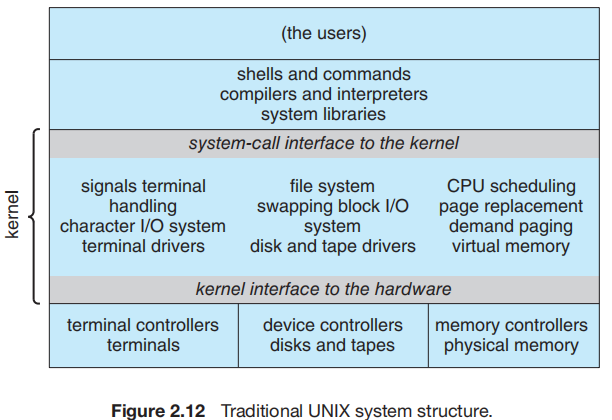
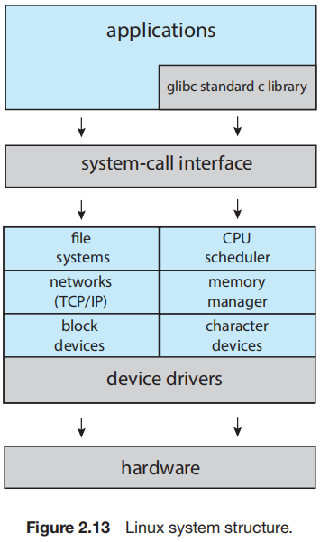
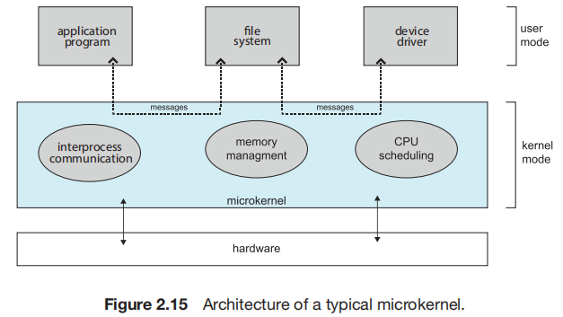
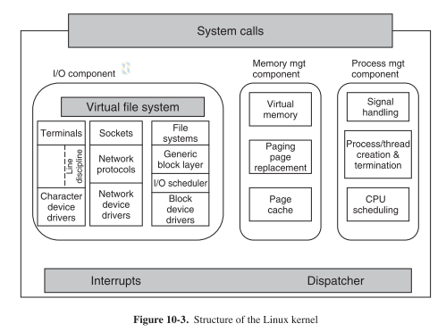
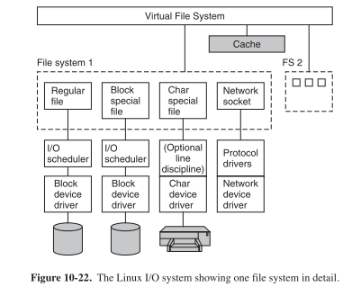

# Lesson 02: Features_of_the_Linux_Kernel

## **Table of Contents**  

- [I. Câu hỏi tự luận](#i-câu-hỏi-tự-luận)  
  - [Bài 1: So sánh Monolithic Kernel và Microkernel](#bài-1-so-sánh-monolithic-kernel-và-microkernel)  
    - [1. Trình bày sự khác biệt giữa Monolithic Kernel và Microkernel](#1-trình-bày-sự-khác-biệt-giữa-monolithic-kernel-và-microkernel)  
    - [2. So sánh ưu nhược điểm của hai mô hình này về hiệu suất, bảo trì, bảo mật](#2-so-sánh-ưu-nhược-điểm-của-hai-mô-hình-này-về-hiệu-suất-bảo-trì-bảo-mật)  
    - [3. Giải thích tại sao Linux sử dụng Monolithic Kernel nhưng vẫn có tính linh hoạt cao](#3-giải-thích-tại-sao-linux-sử-dụng-monolithic-kernel-nhưng-vẫn-có-tính-linh-hoạt-cao)  
    - [4. Monolithic Structure](#4-monolithic-structure)  
    - [5. Microkernels](#5-microkernels)  
    - [6. Modules](#6-modules)  

  - [Bài 2: Mô hình "Everything as a File" trong Linux](#bài-2-mô-hình-everything-as-a-file-trong-linux)  
    - [1. Giải thích mô hình "Everything as a File"](#1-giải-thích-mô-hình-everything-as-a-file)  
    - [2. Nêu các đối tượng trong Linux hoạt động như file](#2-nêu-các-đối-tượng-trong-linux-hoạt-động-như-file)  
    - [3. Chạy lệnh kiểm tra và phân tích đầu ra](#3-chạy-lệnh-kiểm-tra-và-phân-tích-đầu-ra)  

  - [Bài 3: Preemptive Multitasking và Linux Scheduler](#bài-3-preemptive-multitasking-và-linux-scheduler)  
    - [1. Giải thích Preemptive Multitasking là gì](#1-giải-thích-preemptive-multitasking-là-gì)  
    - [2. Mô tả vai trò của Linux Scheduler](#2-mô-tả-vai-trò-của-linux-scheduler)  

- [II. Bài tập thực hành](#ii-bài-tập-thực-hành)  
  - [1. Yêu cầu: Thực hiện trên môi trường Linux](#1-yêu-cầu-thực-hiện-trên-môi-trường-linux)  
    - [1.1 Làm việc với Kernel Module](#11-làm-việc-với-kernel-module)  
    - [1.2 Tìm hiểu hệ thống tập tin trong Linux](#12-tìm-hiểu-hệ-thống-tập-tin-trong-linux)  
    - [1.3 Kiểm tra thông tin CPU và bộ nhớ](#13-kiểm-tra-thông-tin-cpu-và-bộ-nhớ)  
    - [1.4 Ghi dữ liệu vào /dev/null và quan sát kết quả](#14-ghi-dữ-liệu-vào-devnull-và-quan-sát-kết-quả)  
    - [1.5 Quản lý tiến trình trong Linux](#15-quản-lý-tiến-trình-trong-linux)  
    - [1.6 Tạo và quản lý thread trong Linux bằng C](#16-tạo-và-quản-lý-thread-trong-linux-bằng-c)  
    - [1.7 Lập trình với Preemptive Scheduling](#17-lập-trình-với-preemptive-scheduling)  

---

## I. Câu hỏi tự luận

### Bài 1: So sánh Monolithic Kernel và Microkernel

#### 1. Trình bày sự khác biệt giữa Monolithic Kernel và Microkernel

| Đặc điểm              | Monolithic Kernel                                  | Microkernel                                      |
|----------------------|------------------------------------------------|------------------------------------------------|
| **Cấu trúc**        | Kernel chứa hầu hết các dịch vụ hệ điều hành trong một không gian địa chỉ duy nhất. | Kernel chỉ giữ các chức năng lõi, còn các dịch vụ khác chạy ở không gian người dùng. |
| **Hiệu suất**       | Cao hơn do các dịch vụ chạy trực tiếp trong kernel, không cần giao tiếp qua message passing. | Thấp hơn do các dịch vụ phải giao tiếp qua message passing, gây overhead. |
| **Bảo mật & Ổn định** | Kém hơn, vì lỗi trong một phần của kernel có thể làm sập toàn bộ hệ thống. | Cao hơn, vì lỗi trong một dịch vụ người dùng không ảnh hưởng đến kernel. |
| **Khả năng mở rộng** | Khó mở rộng, vì cần sửa đổi trực tiếp kernel và phải biên dịch lại. | Dễ mở rộng, vì có thể thêm dịch vụ mới mà không cần thay đổi kernel. |
| **Giao tiếp**       | Các thành phần gọi trực tiếp lẫn nhau trong kernel. | Các thành phần giao tiếp thông qua **message passing**, gây tốn tài nguyên hơn. |
| **Ví dụ HĐH**       | Linux, Windows, macOS                             | QNX, Minix, Mach (dùng trong macOS) |

#### 2. So sánh ưu nhược điểm của hai mô hình này về hiệu suất, bảo trì, bảo mật

| **Tiêu chí**            | **Monolithic Kernel** | **Microkernel** |
|------------------------|---------------------|----------------|
| **Hiệu suất (Performance)** | ✅ Hiệu suất cao, do tất cả các thành phần chạy trong không gian kernel, giúp giảm độ trễ và overhead khi giao tiếp giữa các thành phần. | ❌ Hiệu suất thấp hơn, do việc sử dụng message passing giữa các dịch vụ chạy trong không gian user và kernel, gây overhead. |
| **Bảo trì (Maintainability)** | ❌ Khó bảo trì, vì toàn bộ kernel là một khối lớn, việc thay đổi một phần có thể ảnh hưởng đến toàn hệ thống. | ✅ Dễ bảo trì, vì các thành phần được tách biệt, có thể thay đổi hoặc cập nhật từng phần mà không làm ảnh hưởng toàn bộ hệ thống. |
| **Bảo mật (Security)** | ❌ Ít bảo mật hơn, vì nếu một lỗi xảy ra trong kernel, nó có thể làm hỏng toàn bộ hệ thống do tất cả chạy trong cùng một không gian địa chỉ. | ✅ Bảo mật cao hơn, vì hầu hết các dịch vụ chạy trong không gian người dùng, nếu một dịch vụ bị lỗi hoặc bị tấn công, hệ thống vẫn có thể hoạt động bình thường. |
| **Mức độ linh hoạt** | ❌ Kém linh hoạt hơn, vì các tính năng mới phải được tích hợp trực tiếp vào kernel, yêu cầu biên dịch lại. | ✅ Linh hoạt hơn, vì có thể thêm hoặc thay đổi dịch vụ dễ dàng mà không cần chỉnh sửa kernel chính. |

**Tóm tắt**:
- **Monolithic Kernel**: Hiệu suất cao, nhưng khó mở rộng và kém bảo mật.
- **Microkernel**: Linh hoạt và bảo mật hơn, nhưng có độ trễ cao do cơ chế message passing.

#### 3. Giải thích tại sao Linux sử dụng Monolithic Kernel nhưng vẫn có tính linh hoạt cao.

- Sử dụng Loadable Kernel Modules (LKMs).
    - LKMs cho phép thêm hoặc gỡ bỏ các thành phần của kernel trong khi hệ thống đang chạy mà không cần biên dịch lại toàn bộ kernel.
    - Điều này giúp Linux có thể mở rộng hoặc thay đổi tính năng dễ dàng mà vẫn giữ hiệu suất cao của Monolithic Kernel.
- Tính Modular trong Kernel.
    - Linux kernel có kiến trúc modular, giúp các thành phần như trình điều khiển thiết bị (device drivers), hệ thống tập tin (file systems), giao thức mạng (network protocols) có thể được tải hoặc gỡ bỏ một cách linh hoạt.
    - Ví dụ: Khi cắm một thiết bị USB vào máy tính, Linux có thể tự động tải driver tương ứng mà không cần khởi động lại hệ thống.
- Hiệu suất cao và khả năng mở rộng.
    - Monolithic Kernel giúp Linux duy trì hiệu suất cao do tất cả các thành phần chạy trong cùng một không gian địa chỉ, tránh được overhead từ message passing như trong Microkernel.
    - Nhờ LKMs, Linux có thể mở rộng mà không làm giảm hiệu suất đáng kể.


----------------------------------
#### 4. Monolithic Structure
Cấu trúc đơn giản nhất để tổ chức một hệ điều hành là không có cấu trúc nào cả. Nói cách khác, đặt toàn bộ chức năng của kernel vào một tệp nhị phân tĩnh duy nhất chạy trong một không gian địa chỉ duy nhất. Cách tiếp cận này—được gọi là cấu trúc monolithic (monolithic structure)—là một kỹ thuật phổ biến trong thiết kế hệ điều hành.
    
Một ví dụ về cấu trúc hạn chế như vậy là hệ điều hành UNIX nguyên bản, bao gồm hai phần có thể tách rời: kernel và các chương trình hệ thống. Kernel được tách thành một loạt giao diện và trình điều khiển thiết bị, những thành phần này đã được bổ sung và mở rộng theo thời gian khi UNIX phát triển. Chúng ta có thể xem hệ điều hành UNIX truyền thống như được phân lớp ở một mức độ nào đó, như minh họa trong Hình 2.12. Mọi thứ bên dưới giao diện lời gọi hệ thống và bên trên phần cứng vật lý đều thuộc về kernel. Kernel cung cấp hệ thống tệp, lập lịch CPU, quản lý bộ nhớ và các chức năng hệ điều hành khác thông qua các lời gọi hệ thống. Khi xem xét tổng thể, đó là một lượng lớn chức năng được kết hợp vào một không gian địa chỉ duy nhất.



Hệ điều hành Linux được xây dựng dựa trên UNIX và có cấu trúc tương tự, như minh họa trong Hình 2.13. Các ứng dụng thường sử dụng thư viện C chuẩn glibc khi giao tiếp với giao diện lời gọi hệ thống của kernel. Kernel của Linux có kiến trúc nguyên khối (monolithic), nghĩa là nó chạy hoàn toàn trong chế độ kernel trong một không gian địa chỉ duy nhất. Tuy nhiên, như chúng ta sẽ thấy trong Mục 2.8.4, nó có thiết kế mô-đun, cho phép kernel được sửa đổi trong thời gian chạy.



#### 5. Microkernels

Chúng ta đã thấy rằng hệ thống UNIX nguyên bản có cấu trúc nguyên khối (monolithic). Khi UNIX mở rộng, kernel trở nên lớn và khó quản lý. Vào giữa những năm 1980, các nhà nghiên cứu tại Đại học Carnegie Mellon đã phát triển một hệ điều hành có tên Mach, sử dụng phương pháp vi nhân (microkernel) để mô-đun hóa kernel. Phương pháp này tổ chức hệ điều hành bằng cách loại bỏ tất cả các thành phần không thiết yếu khỏi kernel và triển khai chúng dưới dạng các chương trình cấp người dùng, chạy trong các không gian địa chỉ riêng biệt. Kết quả là một kernel nhỏ gọn hơn. Tuy nhiên, vẫn chưa có sự đồng thuận rõ ràng về việc dịch vụ nào nên được giữ lại trong kernel và dịch vụ nào nên triển khai trong không gian người dùng. Thông thường, vi nhân chỉ cung cấp quản lý tiến trình tối thiểu, quản lý bộ nhớ, và cơ chế giao tiếp giữa các thành phần. Hình 2.15 minh họa kiến trúc của một vi nhân điển hình.



Chức năng chính của vi nhân là cung cấp cơ chế giao tiếp giữa chương trình khách (client program) và các dịch vụ khác cũng đang chạy trong không gian người dùng. Giao tiếp được thực hiện thông qua truyền thông điệp (message passing), như đã mô tả trong Mục 2.3.3.5. Ví dụ, nếu chương trình khách muốn truy cập một tệp, nó phải tương tác với máy chủ tệp (file server). Tuy nhiên, chương trình khách và dịch vụ không tương tác trực tiếp mà giao tiếp gián tiếp bằng cách trao đổi thông điệp thông qua vi nhân.

Một lợi ích của phương pháp vi nhân là giúp mở rộng hệ điều hành dễ dàng hơn. Các dịch vụ mới được thêm vào không gian người dùng, do đó không cần sửa đổi kernel. Khi cần thay đổi kernel, số lượng chỉnh sửa thường ít hơn, vì vi nhân có kích thước nhỏ gọn hơn. Hệ điều hành có thể dễ dàng chuyển đổi từ thiết kế phần cứng này sang thiết kế phần cứng khác. Vi nhân cũng mang lại bảo mật và độ tin cậy cao hơn, vì hầu hết các dịch vụ chạy dưới dạng tiến trình người dùng thay vì tiến trình kernel. Nếu một dịch vụ gặp lỗi, phần còn lại của hệ điều hành vẫn hoạt động bình thường, không bị ảnh hưởng.

Có lẽ minh họa nổi tiếng nhất về hệ điều hành sử dụng microkernel là Darwin, thành phần kernel của các hệ điều hành macOS và iOS. Thực tế, Darwin bao gồm hai kernel, trong đó có Mach microkernel. Chúng ta sẽ tìm hiểu chi tiết hơn về hệ thống macOS và iOS trong Mục 2.8.5.1.

Một ví dụ khác là QNX, một hệ điều hành thời gian thực (real-time OS) dành cho các hệ thống nhúng. Microkernel QNX Neutrino cung cấp các dịch vụ như truyền thông bằng thông điệp (message passing) và lập lịch tiến trình (process scheduling). Nó cũng xử lý giao tiếp mạng cấp thấp (low-level network communication) và ngắt phần cứng (hardware interrupts). Tất cả các dịch vụ khác trong QNX được cung cấp bởi các tiến trình tiêu chuẩn chạy bên ngoài kernel ở chế độ người dùng (user mode).

Thật không may, hiệu suất của microkernel có thể bị ảnh hưởng do tăng chi phí hệ thống (system-function overhead).
Khi hai dịch vụ ở chế độ người dùng (user-level services) cần giao tiếp với nhau, các thông điệp phải được sao chép giữa các dịch vụ này, vì chúng nằm trong các không gian địa chỉ riêng biệt (separate address spaces). Ngoài ra, hệ điều hành có thể phải chuyển đổi tiến trình (process switching) để trao đổi thông điệp. Chi phí liên quan đến sao chép thông điệp (message copying) và chuyển đổi giữa các tiến trình (process switching) chính là trở ngại lớn nhất đối với sự phát triển của các hệ điều hành dựa trên microkernel. Hãy xem xét lịch sử của Windows NT: Phiên bản đầu tiên có một kiến trúc microkernel phân lớp (layered microkernel organization). Tuy nhiên, hiệu suất của phiên bản này thấp hơn so với Windows 95. Windows NT 4.0 đã phần nào khắc phục vấn đề hiệu suất bằng cách di chuyển một số lớp từ không gian người dùng (user space) sang không gian kernel (kernel space) và tích hợp chúng chặt chẽ hơn. Khi Windows XP ra đời, kiến trúc của Windows đã trở nên monolithic (nguyên khối) hơn so với microkernel. Mục 2.8.5.1 sẽ mô tả cách macOS giải quyết các vấn đề về hiệu suất của Mach microkernel.

### 6. Modules

Có lẽ phương pháp thiết kế hệ điều hành tốt nhất hiện nay là sử dụng các mô-đun kernel có thể tải động (Loadable Kernel Modules - LKMs). Trong mô hình này, kernel có một tập hợp các thành phần lõi (core components) và có thể liên kết thêm các dịch vụ khác thông qua các mô-đun (modules),
có thể được tải vào khi khởi động hệ thống (boot time) hoặc trong quá trình chạy (run time). Loại thiết kế này rất phổ biến trong các hệ điều hành UNIX hiện đại, chẳng hạn như Linux, macOS và Solaris, cũng như trong Windows.

Ý tưởng của thiết kế này là kernel cung cấp các dịch vụ lõi (core services), trong khi các dịch vụ khác được triển khai một cách động (implemented dynamically) khi kernel đang chạy. Việc liên kết (linking) các dịch vụ một cách động tốt hơn so với việc thêm trực tiếp các tính năng mới vào kernel,
vì nếu làm vậy, ta sẽ phải biên dịch lại kernel (recompile the kernel) mỗi khi có sự thay đổi. Ví dụ, chúng ta có thể tích hợp trực tiếp các thuật toán lập lịch CPU (CPU scheduling) và quản lý bộ nhớ (memory management) vào kernel, sau đó thêm hỗ trợ cho các hệ thống tệp khác nhau (different file systems) bằng các mô-đun có thể tải động (loadable modules).

Kết quả tổng thể tương tự như một hệ thống phân lớp (layered system), vì mỗi phần trong kernel đều có giao diện được xác định và bảo vệ (defined, protected interfaces).
Tuy nhiên, nó linh hoạt hơn so với mô hình phân lớp, vì bất kỳ mô-đun nào cũng có thể gọi mô-đun khác (any module can call any other module). Cách tiếp cận này cũng giống với mô hình microkernel, vì mô-đun chính chỉ chứa các chức năng lõi (core functions) và có khả năng tải cũng như giao tiếp với các mô-đun khác (knowledge of how to load and communicate with other modules). Nhưng nó hiệu quả hơn so với microkernel, vì các mô-đun không cần sử dụng truyền thông qua thông điệp (message passing) để giao tiếp với nhau.

Linux sử dụng các mô-đun kernel có thể tải động (Loadable Kernel Modules - LKMs), chủ yếu để hỗ trợ trình điều khiển thiết bị (device drivers) và hệ thống tệp (file systems). LKMs có thể được chèn vào kernel ("inserted" into the kernel) khi hệ thống khởi động (booted) hoặc trong khi chạy (run time), chẳng hạn như khi một thiết bị USB được cắm vào máy đang hoạt động. Nếu kernel của Linux không có driver cần thiết, nó có thể được tải động (dynamically loaded).
LKMs cũng có thể được gỡ bỏ khỏi kernel trong thời gian chạy (removed from the kernel during run time). Đối với Linux, LKMs giúp kernel trở nên linh hoạt và có tính mô-đun (dynamic and modular kernel), trong khi vẫn duy trì hiệu suất cao của hệ thống monolithic (maintaining the performance benefits of a monolithic system). Chúng tôi sẽ hướng dẫn tạo LKMs trong Linux thông qua một số bài tập lập trình ở cuối chương này.

### Bài 2: Mô hình "Everything as a File" trong Linux

#### 1. Giải thích mô hình "Everything as a File"

- Mô hình "Everything as a File" (Mọi thứ đều là File) là một quyết định thiết kế quan trọng trong hệ điều hành UNIX và Linux, theo đó hầu hết các đối tượng hệ thống được biểu diễn dưới dạng file. Điều này cho phép các ứng dụng thao tác với tất cả các đối tượng hệ thống bằng API file thông thường (ví dụ: open, read, write, close).



- Dưới đây là những điểm chính của mô hình này:
    - Thiết bị được biểu diễn như file: Để các ứng dụng có thể tương tác với các thiết bị phần cứng, chúng được biểu diễn thông qua các file đặc biệt gọi là device file. Các file này liên kết một tên file mà người dùng có thể thấy với một thiết bị tương ứng.

    - API thống nhất: Việc sử dụng API file tiêu chuẩn giúp đơn giản hóa quá trình tương tác với các đối tượng hệ thống khác nhau. Các ứng dụng không cần phải sử dụng các lệnh hoặc thư viện đặc biệt cho từng loại đối tượng.

    - Tính trừu tượng: Mô hình này cung cấp một lớp trừu tượng giúp ẩn đi các chi tiết triển khai phức tạp của các thiết bị và tài nguyên hệ thống. Các ứng dụng chỉ cần tương tác với các file, không cần quan tâm đến cách dữ liệu được lưu trữ hoặc thiết bị được điều khiển.

    - Tính nhất quán: Bằng cách đối xử với mọi thứ như file, hệ thống trở nên nhất quán hơn, dễ hiểu và dễ quản lý.

    - File ảo: Mô hình này không giới hạn ở file vật lý trên đĩa. Các file ảo (pseudo-file) như /proc và /sys cũng được sử dụng để thể hiện các cấu trúc dữ liệu của kernel và cung cấp thông tin hệ thống.

        -   /proc và /sys là các pseudo filesystem, thể hiện các cấu trúc dữ liệu kernel dưới dạng một hệ thống phân cấp thư mục và file.

- Cách mô hình "Everything as a File" hoạt động:
    - File system: Các file được tổ chức trong một hệ thống file phân cấp, bắt đầu từ thư mục gốc /.
    - Virtual File System (VFS): Một lớp trừu tượng trong kernel, cung cấp một giao diện thống nhất cho các hệ thống file khác nhau.
        - VFS định nghĩa các đối tượng chính như:
            - Superblock object: Đại diện cho một hệ thống file đã được mount.
            - Inode object: Đại diện cho một file hoặc thư mục.
            - Dentry object: Đại diện cho một thành phần trong đường dẫn.
            - File object: Đại diện cho một file đang mở.
    - Device driver: Mỗi thiết bị có một device driver tương ứng, cung cấp các thao tác chuẩn như open, read, write, và close. Khi một ứng dụng tương tác với một device file, kernel sẽ gọi các hàm tương ứng trong device driver.
#### 2. Nêu các đối tượng trong Linux hoạt động như file (ví dụ: thiết bị, tiến trình).



- Các loại file đặc biệt:
    - File thiết bị (device file): Đại diện cho các thiết bị phần cứng như ổ đĩa, máy in, hoặc cổng giao tiếp. Có hai loại chính:
        - File thiết bị ký tự (character device file): Thường được sử dụng cho các thiết bị truyền dữ liệu theo luồng như bàn phím hoặc cổng nối tiếp.
        - File thiết bị khối (block device file): Thường được sử dụng cho các thiết bị lưu trữ như ổ cứng hoặc ổ đĩa flash.
    - File đặc biệt khác:
        - FIFO (pipe): Được sử dụng cho giao tiếp giữa các tiến trình.
        - Socket file: Được sử dụng cho giao tiếp mạng.

- Lấy ví dụ về file /dev, /proc, socket, process descriptor.
    - File trong /dev (Device Files)
        - Chức năng: Các file trong thư mục /dev là device files, đại diện cho các thiết bị phần cứng hoặc thiết bị ảo. Chúng cung cấp giao diện cho các ứng dụng để tương tác với các thiết bị này.
        - Phân loại: Có hai loại chính:
            - Character device file: (ví dụ: /dev/ttyS0, /dev/null, /dev/random) dùng để giao tiếp với các thiết bị theo luồng byte như cổng serial, bàn phím, chuột, và các thiết bị khác.
            - Block device file: (ví dụ: /dev/sda, /dev/sda1, /dev/hda) dùng để giao tiếp với các thiết bị lưu trữ theo khối dữ liệu như ổ cứng, ổ flash.
        - Ví dụ cụ thể:
            - /dev/sda, /dev/sda1, /dev/sda2: Đại diện cho ổ cứng và các phân vùng của ổ cứng.
            - /dev/ttyS0: Đại diện cho cổng serial.
            - /dev/null: Một thiết bị ảo, mọi dữ liệu ghi vào đây đều bị bỏ qua.
            - /dev/zero: Một thiết bị ảo, khi đọc sẽ trả về các byte 0.
            - /dev/console: Đại diện cho console của hệ thống.
        - Cơ chế hoạt động: Khi một ứng dụng mở một device file, kernel sẽ gọi tới driver thiết bị tương ứng. Driver này sẽ thực hiện các thao tác I/O trên thiết bị thật sự. Các thao tác như open, read, write, close trên device file sẽ được chuyển đến driver thông qua VFS.
        - Tạo device file: Các device file có thể được tạo bằng lệnh mknod hoặc thông qua các trình quản lý thiết bị như udev, mdev.
    - File trong /proc (Process Filesystem)
        - Chức năng: /proc là một pseudo filesystem, không thực sự lưu trữ dữ liệu trên đĩa mà cung cấp một giao diện để xem thông tin về kernel và các tiến trình đang chạy. Các file và thư mục trong /proc được tạo động bởi kernel.
        - Cấu trúc:
            - /proc chứa các thư mục con tương ứng với mỗi tiến trình đang chạy trên hệ thống. Tên của các thư mục này là PID (Process ID) của tiến trình. Ví dụ: /proc/1234 chứa thông tin về tiến trình có PID là 1234.
            - Ngoài ra còn có các file khác trong /proc cung cấp thông tin chung về hệ thống, ví dụ: /proc/cpuinfo, /proc/meminfo, /proc/mounts.
        - Ví dụ cụ thể:
            - /proc/PID/status: Cung cấp thông tin chi tiết về trạng thái của một tiến trình.
            - /proc/PID/fd: Chứa các symbolic link đến các file descriptor mà tiến trình đó đang mở.
            - /proc/mounts: Danh sách các filesystem đã được mount.
            - /proc/devices: Liệt kê các thiết bị (block và character) và số major của chúng.
        - Cơ chế hoạt động: Khi một ứng dụng đọc một file trong /proc, kernel sẽ tạo dữ liệu tương ứng theo yêu cầu của ứng dụng, dữ liệu này có thể là các thông số của hệ thống hoặc thông tin của tiến trình. Các file trong /proc thường là dạng text để các ứng dụng dễ dàng xử lý. Một số file trong /proc có thể được ghi vào để thay đổi các tham số hệ thống.
        - Ứng dụng: Các công cụ hệ thống như ps, top, free sử dụng /proc để lấy thông tin.
    - Socket File
        - Chức năng: Socket file là một loại file đặc biệt được dùng cho giao tiếp mạng (network communication) hoặc giao tiếp giữa các tiến trình trên cùng một máy (IPC - inter-process communication). Chúng không phải là file vật lý trên đĩa.
        - Đặc điểm:
            - Socket file được tạo và quản lý thông qua API socket (ví dụ: BSD socket API).
            - Chúng cho phép các ứng dụng gửi và nhận dữ liệu qua mạng hoặc giữa các tiến trình.
            - Socket file có thể được sử dụng cho cả giao thức TCP và UDP.
            - Không giống như các device file, socket file không có node trong /dev, chúng được truy cập thông qua API socket.
        - Ví dụ: Các ứng dụng web server, client, chat đều sử dụng socket để giao tiếp.
    - Process Descriptor
        - Chức năng: Process descriptor (cấu trúc task_struct trong kernel Linux) là một cấu trúc dữ liệu quan trọng mà kernel sử dụng để lưu trữ thông tin về một tiến trình. Nó không phải là file mà là một cấu trúc trong bộ nhớ kernel.
        - Nội dung: Process descriptor chứa rất nhiều thông tin, bao gồm:
            - PID (Process ID): Số định danh duy nhất của tiến trình.
            - Trạng thái của tiến trình: (ví dụ: running, sleeping, zombie).
            - Thông tin về bộ nhớ: (ví dụ: địa chỉ bộ nhớ, các vùng nhớ đã được cấp phát).
            - Thông tin về file: (ví dụ: danh sách các file descriptor đang mở).
            - Thông tin về tín hiệu: (ví dụ: các tín hiệu đang chờ xử lý).
            - Thông tin về người dùng: (ví dụ: UID, GID).
            - Con trỏ đến các cấu trúc dữ liệu khác: ví dụ, files (con trỏ đến cấu trúc files_struct để quản lý các file đang mở), mm (con trỏ đến cấu trúc mm_struct để quản lý bộ nhớ), ....
        - Liên quan đến file: Cấu trúc task_struct có trường files, trỏ đến cấu trúc files_struct, chứa danh sách các file descriptor (mảng các con trỏ đến các file object) mà tiến trình đang mở. Mỗi file descriptor là một số nguyên nhỏ không âm, là index của mảng này.
        - Mối quan hệ: Khi một tiến trình mở một file, kernel sẽ tạo một file object và một file descriptor, sau đó lưu trữ thông tin về file này trong process descriptor của tiến trình đó.
        - Truy cập: Thông tin trong process descriptor có thể được truy cập (một phần) qua các file trong /proc/PID, ví dụ: /proc/PID/status.

#### 3. Chạy lệnh kiểm tra và phân tích đầu ra để chứng minh rằng Linux áp dụng mô hình này.


### Bài 3: Cách Linux thực hiện Preemptive Multitasking

#### 1. Giải thích Preemptive Multitasking là gì.

 - Preemptive Multitasking là một phương pháp quản lý đa nhiệm trong hệ điều hành, trong đó hệ điều hành (thông qua bộ điều phối - scheduler) có quyền quyết định khi nào một tiến trình đang chạy sẽ bị tạm dừng (preempted) và chuyển quyền sử dụng CPU cho một tiến trình khác.

- Preemptive Multitasking dựa vào hỗ trợ phần cứng, đặc biệt thông qua một bộ định thời tạo ra các ngắt ở các khoảng thời gian nhất định. Khi CPU đang xử lý mã chế độ người dùng và một ngắt phần cứng xảy ra, nó chuyển sang chế độ nhân để xử lý ngắt, với trình xử lý tick bộ định thời thực thi để tính toán thời gian sử dụng CPU của quá trình hiện tại. Điều này cho phép quản lý hiệu quả việc thực thi quá trình và phân bổ tài nguyên.

- Cơ chế hoạt động:
    - Bộ điều phối (scheduler) đóng vai trò trung tâm trong việc quyết định tiến trình nào sẽ chạy.
    - Preemption là hành động tạm dừng một tiến trình đang chạy, thường dựa trên các yếu tố như thời gian chạy hoặc mức độ ưu tiên.
    - Các hệ thống preemptive multitasking thường sử dụng timeslice, là khoảng thời gian mà một tiến trình được phép chạy. Tuy nhiên, Linux sử dụng cơ chế khác cho các tiến trình thông thường.
    - Hệ điều hành theo dõi thời gian sử dụng CPU của từng tiến trình để đưa ra quyết định lập lịch.
    - Preemption có thể xảy ra khi:
        - Một tiến trình đã sử dụng hết timeslice được cấp.
        - Một tiến trình có độ ưu tiên cao hơn chuyển sang trạng thái sẵn sàng (ready).
        - Một tiến trình thực hiện thao tác I/O hoặc một sự kiện block khác.
        - Một ngắt phần cứng hoặc phần mềm xảy ra.

- Cooperative Multitasking: Các tiến trình tự quyết định khi nào chúng sẽ nhường CPU cho tiến trình khác. Điều này có nghĩa là, một tiến trình có thể chiếm giữ CPU vô thời hạn, nếu nó không tự nguyện nhường lại.

#### 2. Mô tả vai trò của Linux Scheduler trong việc quản lý tiến trình.

- Vai trò của Linux Scheduler
    - Quản lý tiến trình: Linux Scheduler quyết định tiến trình nào được chạy trên CPU và khi nào.
    - Điều phối tiến trình: Scheduler quản lý các tiến trình đang ở trạng thái sẵn sàng và chọn tiến trình tiếp theo để chạy dựa trên chính sách và thuật toán.
    - Thực hiện Preemption: Scheduler có quyền tạm dừng tiến trình đang chạy và chuyển CPU cho tiến trình khác khi cần.
    - Các loại Scheduling: Linux hỗ trợ các loại scheduling khác nhau, bao gồm:
        - Timeshare: Dành cho các tiến trình thông thường, đảm bảo công bằng.
        - Real-time: Dành cho các ứng dụng thời gian thực, ưu tiên độ trễ thấp và tính quyết định

- Mô tả thuật toán Completely Fair Scheduler (CFS)
    - Mục tiêu: CFS được thiết kế để đảm bảo tính công bằng trong việc phân chia thời gian CPU giữa các tiến trình đang chạy. 
    - Mô hình hóa: CFS mô hình hóa việc lập lịch tiến trình như thể hệ thống có một bộ xử lý đa nhiệm hoàn hảo, nơi mỗi tiến trình sẽ nhận được 1/n thời gian của bộ xử lý, với n là số lượng tiến trình đang chạy.
    - Không sử dụng timeslice cố định: Khác với các bộ lập lịch truyền thống, CFS không sử dụng timeslice cố định cho các tiến trình. Thay vào đó, nó tính toán thời gian mà mỗi tiến trình nên chạy dựa trên tổng số tiến trình đang chạy và độ ưu tiên của chúng.
    - Cơ chế chính của CFS:
        - vruntime (thời gian chạy ảo):
            - CFS sử dụng một biến vruntime (virtual runtime) để theo dõi thời gian mà một tiến trình đã chạy. vruntime không phải là thời gian thực tế mà tiến trình đã sử dụng CPU, mà là một giá trị được điều chỉnh dựa trên độ ưu tiên của tiến trình.
            - vruntime được tính bằng cách cộng dồn thời gian thực tế mà tiến trình đã chạy, được "chuẩn hóa" (normalized) hoặc "cân bằng" (weighted) bởi số lượng tiến trình có thể chạy (runnable processes).
            - Tiến trình có nice value thấp hơn (ưu tiên cao hơn) sẽ có tốc độ tăng vruntime chậm hơn, cho phép nó chạy lâu hơn so với tiến trình có nice value cao hơn.
            - Đơn vị của vruntime là nanosecond, do đó nó không bị ràng buộc vào timer tick.
        - Cây đỏ-đen (red-black tree):
            - Các tiến trình đang chạy được lưu trữ trong một cây đỏ-đen, một loại cây tìm kiếm nhị phân tự cân bằng.
            - Cây này được sắp xếp dựa trên giá trị vruntime, với tiến trình có vruntime nhỏ nhất nằm ở nút bên trái nhất của cây.
            - Khi cần chọn tiến trình tiếp theo để chạy, CFS chỉ cần lấy nút bên trái nhất của cây, đây chính là tiến trình có vruntime nhỏ nhất.
            - Việc sử dụng cây đỏ-đen đảm bảo rằng việc tìm kiếm tiến trình tiếp theo có thể thực hiện trong thời gian O(log N), với N là số lượng tiến trình đang chạy. Tuy nhiên, Linux scheduler còn cache lại nút bên trái nhất, giúp việc tìm kiếm tiến trình kế tiếp có thể thực hiện trong thời gian O(1).
        - Nice value:
            - Nice value là một giá trị nguyên (từ -20 đến +19) được gán cho mỗi tiến trình, thể hiện độ ưu tiên của tiến trình đó.
            - Nice value thấp hơn tương ứng với độ ưu tiên cao hơn và ngược lại.
            - CFS sử dụng nice value để điều chỉnh tỷ lệ CPU mà mỗi tiến trình nhận được. Tiến trình có nice value thấp hơn sẽ nhận được phần CPU lớn hơn, trong khi tiến trình có nice value cao hơn sẽ nhận được phần CPU nhỏ hơn.
        -   Tính toán thời gian chạy:
            - Thay vì timeslice cố định, CFS tính toán thời gian chạy của mỗi tiến trình dựa trên tỷ lệ giữa trọng số (weight) của tiến trình và tổng trọng số của tất cả các tiến trình đang chạy.
            - Trọng số của tiến trình được điều chỉnh bởi nice value của nó.
            - CFS xác định một targeted latency (độ trễ mục tiêu), là khoảng thời gian mà mỗi tiến trình chạy ít nhất một lần. Thời gian chạy của từng tiến trình sẽ được điều chỉnh sao cho đạt được mục tiêu này.
            - Ngoài ra, CFS còn có một giá trị gọi là minimum granularity (độ chi tiết tối thiểu), là thời gian chạy tối thiểu của một tiến trình, nhằm tránh overhead do context switch quá thường xuyên.

## II. Bài tập thực hành.

### 1. Yêu cầu: Thực hiện trên môi trường Linux, kiểm tra đầu ra của từng bước.

#### 1.1 Làm việc với Kernel Module

- Kiểm tra các module kernel đang chạy.
    - Lệnh: `lsmod` liệt kê tất cả các kernel module đang được tải trên hệ thống.
    - Kết quả hiển thị gồm:
        - Module: Tên module.
        - Size: Kích thước của module (bytes).
        - Used by: Các tiến trình hoặc module khác đang sử dụng module này.
    ```
    admin@raspberrypi:/ $ lsmod
    Module                  Size  Used by
    rfcomm                 53248  4
    snd_seq_dummy          12288  0
    snd_hrtimer            12288  1
    snd_seq                81920  7 snd_seq_dummy
    snd_seq_device         16384  1 snd_seq
    cmac                   12288  2
    algif_hash             12288  1
    aes_arm64              12288  2
    aes_generic            32768  1 aes_arm64
    algif_skcipher         12288  1
    af_alg                 24576  6 algif_hash,algif_skcipher
    bnep                   24576  2
    brcmfmac_wcc           12288  0
    brcmfmac              348160  1 brcmfmac_wcc
    brcmutil               24576  1 brcmfmac
    hci_uart               49152  0
    binfmt_misc            16384  1
    cfg80211              983040  1 brcmfmac
    btbcm                  24576  1 hci_uart
    bluetooth             606208  33 hci_uart,btbcm,bnep,rfcomm
    rpivid_hevc            45056  0
    bcm2835_codec          45056  0
    ecdh_generic           16384  1 bluetooth
    ecc                    36864  1 ecdh_generic
    bcm2835_isp            28672  0
    v4l2_mem2mem           45056  2 bcm2835_codec,rpivid_hevc
    bcm2835_v4l2           40960  0
    raspberrypi_hwmon      12288  0
    bcm2835_mmal_vchiq     36864  3 bcm2835_codec,bcm2835_v4l2,bcm2835_isp
    libaes                 12288  3 aes_arm64,bluetooth,aes_generic
    videobuf2_vmalloc      12288  1 bcm2835_v4l2
    rfkill                 32768  6 bluetooth,cfg80211
    videobuf2_dma_contig    16384  3 bcm2835_codec,rpivid_hevc,bcm2835_isp
    videobuf2_memops       12288  2 videobuf2_vmalloc,videobuf2_dma_contig
    videobuf2_v4l2         32768  5 bcm2835_codec,bcm2835_v4l2,rpivid_hevc,v4l2_mem2mem,bcm2835_isp
    vc_sm_cma              28672  2 bcm2835_mmal_vchiq,bcm2835_isp
    snd_bcm2835            24576  1
    videodev              303104  6 bcm2835_codec,videobuf2_v4l2,bcm2835_v4l2,rpivid_hevc,v4l2_mem2mem,bcm2835_isp
    raspberrypi_gpiomem    12288  0

    ```
- Xem thông tin về module kernel cụ thể
    - Lệnh: `modinfo <Module>` hiển thị thông tin chi tiết về module (hệ thống tập tin mặc định trong Linux).
    - Kết quả có thể gồm:
        - filename: Đường dẫn của module.
        - description: Mô tả chức năng.
        - license: Loại giấy phép (thường là GPL).
        - author: Người phát triển module.
        - parameters: Các tham số có thể điều chỉnh.
    
    ```    
    admin@raspberrypi:/ $ modinfo ipv6
    filename:       /lib/modules/6.6.51+rpt-rpi-v8/kernel/net/ipv6/ipv6.ko.xz
    alias:          net-pf-10
    license:        GPL
    description:    IPv6 protocol stack for Linux
    author:         Cast of dozens
    srcversion:     128449D650A5D24900F20C4
    depends:
    intree:         Y
    name:           ipv6
    vermagic:       6.6.51+rpt-rpi-v8 SMP preempt mod_unload modversions aarch64
    parm:           disable:Disable IPv6 module such that it is non-functional (int)
    parm:           disable_ipv6:Disable IPv6 on all interfaces (int)
    parm:           autoconf:Enable IPv6 address autoconfiguration on all interfaces (int)
    ```
#### 1.2 Tìm hiểu hệ thông tập tin trong Linux

- Liết kê các thiết bị trong /dev:
    - Lệnh `ls -l /dev`: Liệt kê các file đại diện cho thiết bị phần cứng (disk, USB, tty, null…).
    - File trong /dev/ có thể là:
        - Character devices (c): /dev/tty, /dev/null
        - Block devices (b): /dev/sda, /dev/loop0
        - Symbolic links (l): /dev/cdrom -> /dev/sr0
    
    ```
    admin@raspberrypi:/ $ ls -l /dev/
    total 0
    crw-r--r--  1 root  root    10, 235 Feb 13 09:17 autofs
    drwxr-xr-x  2 root  root        580 Feb 13 09:50 block
    crw-------  1 root  root    10, 234 Feb 13 09:17 btrfs-control
    drwxr-xr-x  3 root  root         60 Jan  1  1970 bus
    crw-------  1 root  root    10, 126 Feb 13 09:17 cachefiles
    crw-rw----  1 root  video  240,   0 Feb 13 09:17 cec0
    crw-rw----  1 root  video  240,   1 Feb 13 09:17 cec1
    drwxr-xr-x  2 root  root       3280 Feb 13 09:50 char
    crw--w----  1 root  tty      5,   1 Feb 13 09:51 console
    crw-------  1 root  root    10, 123 Feb 13 09:17 cpu_dma_latency
    crw-------  1 root  root    10, 203 Feb 13 09:17 cuse
    drwxr-xr-x  8 root  root        160 Jan  1  1970 disk
    drwxr-xr-x  2 root  root        100 Feb 13 09:17 dma_heap
    drwxr-xr-x  3 root  root        120 Feb 13 09:17 dri
    lrwxrwxrwx  1 root  root         13 Jan  1  1970 fd -> /proc/self/fd
    crw-rw-rw-  1 root  root     1,   7 Feb 13 09:17 full
    crw-rw-rw-  1 root  root    10, 229 Feb 13 09:17 fuse
    crw-rw----+ 1 root  gpio   254,   0 Feb 13 09:17 gpiochip0
    crw-rw----+ 1 root  gpio   254,   1 Feb 13 09:17 gpiochip1
    lrwxrwxrwx  1 root  root          9 Feb 13 09:17 gpiochip4 -> gpiochip0
    crw-rw----  1 root  gpio   237,   0 Feb 13 09:50 gpiomem
    crw-------  1 root  root    10, 183 Feb 13 09:50 hwrng
    crw-rw----  1 root  i2c     89,  20 Feb 13 09:17 i2c-20
    crw-rw----  1 root  i2c     89,  21 Feb 13 09:17 i2c-21
    lrwxrwxrwx  1 root  root         12 Nov 13 04:51 initctl -> /run/initctl
    drwxr-xr-x  3 root  root        160 Feb 13 09:17 input
    crw-r--r--  1 root  root     1,  11 Feb 13 09:17 kmsg
    crw-rw----+ 1 root  kvm     10, 232 Feb 13 09:50 kvm
    lrwxrwxrwx  1 root  root         28 Nov 13 04:51 log -> /run/systemd/journal/dev-log
    brw-rw----  1 root  disk     7,   0 Feb 13 09:17 loop0
    brw-rw----  1 root  disk     7,   1 Feb 13 09:17 loop1
    brw-rw----  1 root  disk     7,   2 Feb 13 09:17 loop2
    brw-rw----  1 root  disk     7,   3 Feb 13 09:17 loop3
    brw-rw----  1 root  disk     7,   4 Feb 13 09:17 loop4
    brw-rw----  1 root  disk     7,   5 Feb 13 09:17 loop5
    brw-rw----  1 root  disk     7,   6 Feb 13 09:17 loop6
    brw-rw----  1 root  disk     7,   7 Feb 13 09:17 loop7
    crw-rw----  1 root  disk    10, 237 Feb 13 09:50 loop-control
    drwxr-xr-x  2 root  root         60 Feb 13 09:17 mapper
    crw-rw----+ 1 root  video  238,   0 Feb 13 09:50 media0
    crw-rw----+ 1 root  video  238,   1 Feb 13 09:50 media1
    crw-rw----+ 1 root  video  238,   2 Feb 13 09:50 media2
    crw-rw----+ 1 root  video  238,   3 Feb 13 09:50 media3
    crw-r-----  1 root  kmem     1,   1 Feb 13 09:50 mem
    brw-rw----  1 root  disk   179,   0 Feb 13 09:17 mmcblk0
    brw-rw----  1 root  disk   179,   1 Feb 13 09:50 mmcblk0p1
    brw-rw----  1 root  disk   179,   2 Feb 13 09:17 mmcblk0p2
    drwxrwxrwt  2 root  root         40 Jan  1  1970 mqueue
    drwxr-xr-x  2 root  root         60 Feb 13 09:17 net
    crw-rw-rw-  1 root  root     1,   3 Feb 13 09:17 null
    crw-r-----  1 root  kmem     1,   4 Feb 13 09:17 port
    crw-------  1 root  root   108,   0 Feb 13 09:17 ppp
    crw-rw-rw-  1 root  tty      5,   2 Feb 14 17:55 ptmx
    drwxr-xr-x  2 root  root          0 Jan  1  1970 pts
    brw-rw----  1 root  disk     1,   0 Feb 13 09:17 ram0
    brw-rw----  1 root  disk     1,   1 Feb 13 09:17 ram1
    brw-rw----  1 root  disk     1,  10 Feb 13 09:17 ram10
    brw-rw----  1 root  disk     1,  11 Feb 13 09:17 ram11
    brw-rw----  1 root  disk     1,  12 Feb 13 09:17 ram12
    brw-rw----  1 root  disk     1,  13 Feb 13 09:17 ram13
    brw-rw----  1 root  disk     1,  14 Feb 13 09:17 ram14
    brw-rw----  1 root  disk     1,  15 Feb 13 09:17 ram15
    brw-rw----  1 root  disk     1,   2 Feb 13 09:17 ram2
    brw-rw----  1 root  disk     1,   3 Feb 13 09:17 ram3
    brw-rw----  1 root  disk     1,   4 Feb 13 09:17 ram4
    brw-rw----  1 root  disk     1,   5 Feb 13 09:17 ram5
    brw-rw----  1 root  disk     1,   6 Feb 13 09:17 ram6
    brw-rw----  1 root  disk     1,   7 Feb 13 09:17 ram7
    brw-rw----  1 root  disk     1,   8 Feb 13 09:17 ram8
    brw-rw----  1 root  disk     1,   9 Feb 13 09:17 ram9
    crw-rw-rw-  1 root  root     1,   8 Feb 13 09:17 random
    crw-rw-r--+ 1 root  netdev  10, 242 Feb 13 09:50 rfkill
    drwxrwxrwt  2 root  root         80 Feb 13 09:51 shm

    ```
#### 1.3 Kiểm tra thông tin CPU và bộ nhớ

- Lệnh `cat /proc/cpuinfo` hiển thị thông tin về CPU (số lõi, model, tốc độ xung nhịp).
- Lệnh `cat /proc/meminfo`hiển thị thông tin về RAM (tổng dung lượng, dung lượng đang sử dụng, cache...).

- Ví dụ /proc/cpuinfo:
```
admin@raspberrypi:/ $ cat /proc/cpuinfo
processor       : 0
BogoMIPS        : 108.00
Features        : fp asimd evtstrm crc32 cpuid
CPU implementer : 0x41
CPU architecture: 8
CPU variant     : 0x0
CPU part        : 0xd08
CPU revision    : 3

processor       : 1
BogoMIPS        : 108.00
Features        : fp asimd evtstrm crc32 cpuid
CPU implementer : 0x41
CPU architecture: 8
CPU variant     : 0x0
CPU part        : 0xd08
CPU revision    : 3

processor       : 2
BogoMIPS        : 108.00
Features        : fp asimd evtstrm crc32 cpuid
CPU implementer : 0x41
CPU architecture: 8
CPU variant     : 0x0
CPU part        : 0xd08
CPU revision    : 3

processor       : 3
BogoMIPS        : 108.00
Features        : fp asimd evtstrm crc32 cpuid
CPU implementer : 0x41
CPU architecture: 8
CPU variant     : 0x0
CPU part        : 0xd08
CPU revision    : 3

Revision        : c03115
Serial          : 10000000e8c5b766
Model           : Raspberry Pi 4 Model B Rev 1.5
```
- Ví dụ /proc/meminfo:
```
admin@raspberrypi:/ $ cat /proc/meminfo
MemTotal:        3882992 kB
MemFree:         3144784 kB
MemAvailable:    3560556 kB
Buffers:           30328 kB
Cached:           452652 kB
SwapCached:            0 kB
Active:           398928 kB
Inactive:         223588 kB
Active(anon):     161168 kB
Inactive(anon):        0 kB
Active(file):     237760 kB
Inactive(file):   223588 kB
Unevictable:       10160 kB
Mlocked:              16 kB
SwapTotal:        204796 kB
SwapFree:         204796 kB
Zswap:                 0 kB
Zswapped:              0 kB
Dirty:                 0 kB
Writeback:             0 kB
AnonPages:        149712 kB
Mapped:           166236 kB
Shmem:             21632 kB
KReclaimable:      22600 kB
Slab:              51156 kB
SReclaimable:      22600 kB
SUnreclaim:        28556 kB
KernelStack:        4800 kB
PageTables:         6012 kB
SecPageTables:         0 kB
NFS_Unstable:          0 kB
Bounce:                0 kB
WritebackTmp:          0 kB
CommitLimit:     2146292 kB
Committed_AS:    1348428 kB
VmallocTotal:   257687552 kB
VmallocUsed:       12420 kB
VmallocChunk:          0 kB
Percpu:              720 kB
CmaTotal:         524288 kB
CmaFree:          505064 kB

```

#### 1.4 Ghi dữ liệu vào /dev/null và quan sát kết quả

- Lệnh `echo "Test" > /dev/null`: ghi "Test" vào /dev/null, nhưng vì /dev/null là "thùng rác" của hệ thống, mọi thứ ghi vào đây sẽ bị xóa ngay lập tức.
- Không có gì hiển thị vì dữ liệu không được lưu trữ.

#### 1.5 Quản lý tiến trình trong Linux

- Liệt kê tất cả tiến trình đang chạy:
    - Lệnh `ps aux`: hiển thị danh sách toàn bộ tiến trình đang chạy.
    - Các cột quan trọng:
        - USER: Người chạy tiến trình.
        - PID: ID của tiến trình.
        - %CPU: CPU sử dụng.
        - %MEM: RAM sử dụng.
        - COMMAND: Lệnh chạy tiến trình.
    - Ví dụ: 

    ```
    admin@raspberrypi:/ $ ps aux
    USER       PID %CPU %MEM    VSZ   RSS TTY      STAT START   TIME COMMAND
    ...
    root       363  0.0  0.0      0     0 ?        S    14:50   0:00 [vchiq-keep/0]
    root       371  0.0  0.0      0     0 ?        S<   14:50   0:00 [SMIO]
    root       379  0.0  0.0      0     0 ?        I<   14:50   0:00 [kworker/R-mmal-]
    root       386  0.0  0.0      0     0 ?        I<   14:50   0:00 [kworker/R-mmal-]
    root       388  0.0  0.0      0     0 ?        S    14:50   0:00 [irq/53-feb10000.code
    root       391  0.0  0.0      0     0 ?        I<   14:50   0:00 [kworker/R-mmal-]
    root       396  0.0  0.0      0     0 ?        I<   14:50   0:00 [kworker/R-mmal-]
    root       404  0.0  0.0      0     0 ?        I<   14:50   0:00 [kworker/R-mmal-]
    root       406  0.0  0.0      0     0 ?        I<   14:50   0:00 [kworker/R-mmal-]
    root       410  0.0  0.0      0     0 ?        I<   14:50   0:00 [kworker/R-mmal-]
    root       458  0.0  0.0      0     0 ?        I    14:50   0:00 [kworker/u11:3-events
    root       459  0.0  0.0      0     0 ?        I    14:50   0:00 [kworker/u11:4-events
    systemd+   461  0.0  0.1  23580  5760 ?        Ssl  14:50   0:00 /lib/systemd/systemd-
    root       467  0.0  0.0      0     0 ?        I<   14:50   0:00 [kworker/R-cfg80]
    root       496  0.0  0.0      0     0 ?        I<   14:50   0:00 [kworker/R-brcmf]
    root       497  0.0  0.0      0     0 ?        S    14:50   0:00 [brcmf_wdog/mmc1:0001
    root       500  0.0  0.1  43712  6768 ?        Ssl  14:50   0:00 /usr/libexec/accounts
    avahi      503  0.0  0.0   6404  3072 ?        Ss   14:50   0:00 avahi-daemon: running
    root       504  0.0  0.0   7984  2432 ?        Ss   14:50   0:00 /usr/sbin/cron -f
    message+   506  0.0  0.1   8284  4096 ?        Ss   14:50   0:02 /usr/bin/dbus-daemon
    root       507  0.0  0.0      0     0 ?        I<   14:50   0:00 [kworker/u13:3-hci0]
    avahi      514  0.0  0.0   6244  1152 ?        S    14:50   0:00 avahi-daemon: chroot
    polkitd    517  0.0  0.2  49840  8128 ?        Ssl  14:50   0:00 /usr/lib/polkit-1/pol
    root       532  0.0  0.1  31352  6400 ?        Ss   14:50   0:00 /lib/systemd/systemd-
    nobody     538  0.0  0.0   5032  2432 ?        Ss   14:50   0:00 /usr/sbin/thd --trigg
    root       544  0.0  0.2  68456 10140 ?        Ssl  14:50   0:00 /usr/libexec/udisks2/
    root       607  0.0  0.4  63652 16688 ?        Ssl  14:50   0:02 /usr/sbin/NetworkMana
    root       623  0.0  0.2  13740  9216 ?        Ss   14:50   0:00 /sbin/wpa_supplicant
    root       651  0.0  0.2  61252  9840 ?        Ssl  14:50   0:00 /usr/sbin/ModemManage
    root       681  0.0  0.1  10856  4992 ?        Ss   14:50   0:00 /usr/libexec/bluetoot
    nobody     735  0.0  0.0   2148  1284 ?        S    14:50   0:00 /usr/share/remoteit/d
    vnc        749  0.0  0.0   2140  1280 ?        Ss   14:50   0:00 /bin/sh /usr/sbin/way
    root       756  0.0  0.0   2068  1280 ?        S    14:50   0:00 /usr/share/remoteit/s
    root       768  0.0  0.1  47132  6112 ?        Ssl  14:50   0:00 /usr/sbin/lightdm
    vnc        800  0.0  1.7 385228 68224 ?        SLl  14:50   0:00 wayvnc --render-curso
    root       813  0.0  0.0   2424  1920 ?        S    14:50   0:07 /usr/share/remoteit/c
    root       815  0.0  0.0   2424  1792 ?        S    14:50   0:07 /usr/share/remoteit/c
    root       819  0.0  0.1  13344  7552 ?        Ss   14:50   0:00 sshd: /usr/sbin/sshd
    root       845  0.0  0.1  29744  6656 ?        Sl   14:50   0:00 lightdm --session-chi
    admin      908  0.0  0.2  16660  9088 ?        Ss   14:50   0:00 /lib/systemd/systemd
    admin      941  0.0  0.1  37568  5260 ?        S    14:50   0:00 (sd-pam)
    root       942  0.0  0.3  32444 15104 ?        Ss   14:50   0:00 python /usr/sbin/wayv
    admin      967  0.0  0.3  43116 12160 ?        S<sl 14:50   0:00 /usr/bin/pipewire
    admin      968  0.0  0.1  22100  4608 ?        Ssl  14:50   0:00 /usr/bin/pipewire -c
    admin      969  0.0  0.6 121392 24792 ?        S<sl 14:50   0:00 /usr/bin/wireplumber
    admin      970  0.0  0.1  35840  7552 ?        S<sl 14:50   0:00 /usr/bin/pipewire-pul
    admin      971  0.0  0.0   7616  3840 ?        Ss   14:50   0:00 /usr/bin/dbus-daemon
    admin      994  0.0  0.1  43272  5888 ?        Ssl  14:50   0:00 /usr/libexec/xdg-perm
    rtkit     1016  0.0  0.0  21808  2688 ?        SNsl 14:50   0:00 /usr/libexec/rtkit-da
    admin     1021  0.0  2.0 292840 78848 ?        Ssl  14:50   0:01 /usr/bin/labwc -m
    root      1067  0.0  0.0      0     0 ?        S<   14:50   0:00 [krfcommd]
    admin     1084  0.0  0.0   6104  1404 ?        Ss   14:50   0:00 /usr/bin/ssh-agent /u
    root      1166  0.0  0.0   4820  2944 tty1     Ss   14:50   0:00 /bin/login -f
    admin     1191  0.0  0.0   8576  3840 tty1     S+   14:50   0:00 -bash
    admin     1216  0.0  0.0   2140  1280 ?        S    14:50   0:00 /bin/sh /usr/bin/lwre
    admin     1217  0.0  0.0   2140  1280 ?        S    14:50   0:00 /bin/sh /usr/bin/lwre
    admin     1218  0.0  0.0   2448  1408 ?        S    14:50   0:00 /usr/bin/kanshi
    admin     1229  0.0  0.4  77088 17364 ?        Sl   14:50   0:00 /usr/libexec/polkit-m
    admin     1242  0.0  0.1  14196  4992 ?        S    14:50   0:00 systemd-inhibit --wha
    admin    27385  600  0.1  11860  4224 pts/0    R+   18:05   0:00 ps aux

    ```
- Xem thông tin tiến trình theo thời gian thực:
    - Lệnh `top`: hiển thị danh sách tiến trình theo thời gian thực.
    - Nhấn q để thoát.
    - Các cột quan trọng:
        - PID: Mã tiến trình.
        - PR: Mức ưu tiên.
        - NI: Giá trị nice (ưu tiên).
        - VIRT: Bộ nhớ ảo sử dụng.
        - RES: Bộ nhớ thực sử dụng.
        - %CPU / %MEM: Phần trăm CPU / RAM sử dụng.
    - Ví dụ:
    ```
    admin@raspberrypi:/ $ top
    top - 18:09:34 up  3:18,  3 users,  load average: 0.04, 0.05, 0.00
    Tasks: 199 total,   2 running, 197 sleeping,   0 stopped,   0 zombie
    %Cpu(s):  0.3 us,  0.8 sy,  0.0 ni, 98.8 id,  0.0 wa,  0.0 hi,  0.0 si,  0.0 st
    MiB Mem :   3792.0 total,   3068.7 free,    317.2 used,    493.8 buff/cache
    MiB Swap:    200.0 total,    200.0 free,      0.0 used.   3474.8 avail Mem

    PID USER      PR  NI    VIRT    RES    SHR S  %CPU  %MEM     TIME+ COMMAND
    1977 admin     20   0    7816   2688   2560 S   0.7   0.1   0:25.24 bash
    28807 admin     20   0   12340   4736   2688 R   0.7   0.1   0:00.13 top
    1962 admin     20   0   15068   6616   5120 S   0.3   0.2   0:18.21 sshd
    1 root      20   0   37084  11328   8044 S   0.0   0.3   0:09.98 systemd
    2 root      20   0       0      0      0 S   0.0   0.0   0:00.02 kthreadd
    3 root      20   0       0      0      0 S   0.0   0.0   0:00.00 pool_workqueue_+
    4 root       0 -20       0      0      0 I   0.0   0.0   0:00.00 kworker/R-rcu_g
    5 root       0 -20       0      0      0 I   0.0   0.0   0:00.00 kworker/R-rcu_p
    6 root       0 -20       0      0      0 I   0.0   0.0   0:00.00 kworker/R-slub_
    7 root       0 -20       0      0      0 I   0.0   0.0   0:00.00 kworker/R-netns
    11 root      20   0       0      0      0 I   0.0   0.0   0:00.07 kworker/u8:0-ex+
    12 root       0 -20       0      0      0 I   0.0   0.0   0:00.00 kworker/R-mm_pe
    13 root      20   0       0      0      0 I   0.0   0.0   0:00.00 rcu_tasks_kthre+
    14 root      20   0       0      0      0 I   0.0   0.0   0:00.00 rcu_tasks_rude_+
    15 root      20   0       0      0      0 I   0.0   0.0   0:00.00 rcu_tasks_trace+
    16 root      20   0       0      0      0 S   0.0   0.0   0:00.15 ksoftirqd/0
    17 root      20   0       0      0      0 R   0.0   0.0   0:01.43 rcu_preempt
    18 root      rt   0       0      0      0 S   0.0   0.0   0:00.01 migration/0
    19 root      20   0       0      0      0 S   0.0   0.0   0:00.00 cpuhp/0
    20 root      20   0       0      0      0 S   0.0   0.0   0:00.00 cpuhp/1
    21 root      rt   0       0      0      0 S   0.0   0.0   0:00.01 migration/1
    22 root      20   0       0      0      0 S   0.0   0.0   0:00.10 ksoftirqd/1
    25 root      20   0       0      0      0 S   0.0   0.0   0:00.00 cpuhp/2
    26 root      rt   0       0      0      0 S   0.0   0.0   0:00.00 migration/2
    27 root      20   0       0      0      0 S   0.0   0.0   0:00.12 ksoftirqd/2
    30 root      20   0       0      0      0 S   0.0   0.0   0:00.00 cpuhp/3
    31 root      rt   0       0      0      0 S   0.0   0.0   0:00.01 migration/3
    32 root      20   0       0      0      0 S   0.0   0.0   0:00.13 ksoftirqd/3
    39 root      20   0       0      0      0 S   0.0   0.0   0:00.00 kdevtmpfs
    40 root       0 -20       0      0      0 I   0.0   0.0   0:00.00 kworker/R-inet_
    42 root      20   0       0      0      0 S   0.0   0.0   0:00.00 kauditd
    44 root      20   0       0      0      0 S   0.0   0.0   0:00.01 khungtaskd
    45 root      20   0       0      0      0 S   0.0   0.0   0:00.00 oom_reaper
    46 root       0 -20       0      0      0 I   0.0   0.0   0:00.00 kworker/R-write
    47 root      20   0       0      0      0 S   0.0   0.0   0:00.43 kcompactd0
    48 root       0 -20       0      0      0 I   0.0   0.0   0:00.00 kworker/R-kinte
    49 root       0 -20       0      0      0 I   0.0   0.0   0:00.00 kworker/R-kbloc
    50 root       0 -20       0      0      0 I   0.0   0.0   0:00.00 kworker/R-blkcg
    51 root      20   0       0      0      0 I   0.0   0.0   0:00.86 kworker/u12:1-e+
    52 root      20   0       0      0      0 I   0.0   0.0   0:00.05 kworker/u12:2-e+
    53 root     -51   0       0      0      0 S   0.0   0.0   0:00.00 watchdogd
    56 root       0 -20       0      0      0 I   0.0   0.0   0:00.00 kw
    ```
- Kết thúc một tiến trình cụ thể:
    - Lệnh `kill -9 <PID>`: gửi tín hiệu SIGKILL, buộc tiến trình dừng ngay lập tức ngoại trừ tiến trình zombie.
    - Kiểm tra PID bằng ps aux trước khi dùng kill.
    ```
    admin@raspberrypi:~ $ ps aux | grep main
    admin     1305  100  0.0   2048  1152 pts/0    R+   18:23   0:36 ./main
    admin     1309  0.0  0.0      0     0 pts/0    Z+   18:23   0:00 [main] <defunct>
    admin     1579  0.0  0.0   7520  1792 pts/1    S+   18:24   0:00 grep --color=auto main

    ```
    - Quan sát thay đổi trước và sau khi kill tiến trình
    ```
    admin@raspberrypi:~ $ kill -9 1305
    admin@raspberrypi:~ $ ps aux | grep main
    admin     2262  0.0  0.0   7520  1792 pts/1    S+   18:26   0:00 grep --color=auto main

    ```
#### 1.6 Tạo và quản lý thread trong Linux bằng C
- Viết chương trình tạo 3 thread in ra thông điệp.
    - Chạy chương trình:
    ```
    admin@raspberrypi:~ $ gcc threads.c -o threads
    admin@raspberrypi:~ $ ./threads
    Thread 0 has ID: 4156900352
    Thread 2 has ID: 4140114944
    Thread 1 has ID: 4148507648
    ```
#### 1.7 Lập trình với Preemptive Scheduling

- Viết chương trình tạo 2 process con.
- Biên dịch chương trình:
    ```
    admin@raspberrypi:~ $ gcc processes.c -o processes
    ```
- Bởi vì nice() cần cấp quyền root:
    ```
    admin@raspberrypi:~ $ sudo su
    root@raspberrypi:/home/admin#
    ```
- Chạy chương trình:
    - Terminal 1:
        ```
        root@raspberrypi:/home/admin# ./processes
        Parent Process (PID: 8466) has been running for: 5650220557734 ns (5650.220558 seconds
        Child Process 1 (PID: 8467) has been running for: 5650277345853 ns (5650.277346 second
        Child Process 2 (PID: 8468) has been running for: 5650307861761 ns (5650.307862 second
        Parent Process (PID: 8466) has been running for: 5650320682138 ns (5650.320682 seconds
        Child Process 1 (PID: 8467) has been running for: 5650377498553 ns (5650.377499 second
        Child Process 2 (PID: 8468) has been running for: 5650408097423 ns (5650.408097 second
        Parent Process (PID: 8466) has been running for: 5650420823004 ns (5650.420823 seconds
        Child Process 1 (PID: 8467) has been running for: 5650477885917 ns (5650.477886 second
        Child Process 2 (PID: 8468) has been running for: 5650508326566 ns (5650.508327 second
        Parent Process (PID: 8466) has been running for: 5650520969000 ns (5650.520969 seconds
        Child Process 1 (PID: 8467) has been running for: 5650578017709 ns (5650.578018 second
        Child Process 2 (PID: 8468) has been running for: 5650608487414 ns (5650.608487 second
        Parent Process (PID: 8466) has been running for: 5650621106348 ns (5650.621106 seconds
        Child Process 1 (PID: 8467) has been running for: 5650678158631 ns (5650.678159 second
        ```
        ```
        root@raspberrypi:/home/admin# nice -n 10 ./processes
        Parent Process (PID: 19570) has been running for: 59000435471 ns (59.000435 seconds)
        Child Process 2 (PID: 19572) has been running for: 59000482081 ns (59.000482 seconds)
        Child Process 1 (PID: 19571) has been running for: 59100009610 ns (59.100010 seconds)
        Parent Process (PID: 19570) has been running for: 59100572016 ns (59.100572 seconds)
        Child Process 2 (PID: 19572) has been running for: 59100612960 ns (59.100613 seconds)
        Child Process 1 (PID: 19571) has been running for: 59200224155 ns (59.200224 seconds)
        Parent Process (PID: 19570) has been running for: 59200713616 ns (59.200714 seconds)
        Child Process 2 (PID: 19572) has been running for: 59200935800 ns (59.200936 seconds)
        ```
    - Terminal 2:
    ```
    admin@raspberrypi:~ $ ps -eo pid,pri,ni,cmd | grep process
    8169  19   0 ./process
    8170  38 -19 ./process
    8171   0  19 ./process
    8256  19   0 grep --color=auto process
    ```
        - Thử chạy tiến trình với nice -n 10 ./program.
    ```
    admin@raspberrypi:~ $ ps -eo pid,pri,ni,cmd | grep process
    19570   9  10 ./process
    19571  28  -9 ./process
    19572   0  19 ./process
    19603  19   0 grep --color=auto process
    ```
- Quan sát xem tiến trình thì tiến trình có Nice nhỏ hơn sẽ chạy nhanh hơn.
    - Process 1 có ID 19571 có nice = -9 sẽ chạy nhanh hơn Process 2 có ID 19572 CÓ nice = 19.